# Exercise 1: Secure administration and management

### Estimated Duration: 120 Minutes

## Overview

**Azure Monitor Network Insights** provides a comprehensive and visual representation of the health and metrics of all deployed network resources through topologies, without requiring any configuration. It also offers access to network monitoring capabilities such as Connection Monitor, flow logging for network security groups (NSGs), and traffic analytics.

The topology capability of **Azure Network Watcher** allows you to view all the resources in a virtual network, the resources associated with those in a virtual network, and the relationships between these resources.

**Azure Bastion** is a fully managed service provided by Microsoft Azure that enables secure and seamless Remote Desktop Protocol (RDP) and Secure Shell (SSH) access to virtual machines (VMs) within a virtual network (VNet) without the need for a public IP address or a virtual private network (VPN) connection.

## Lab Objectives

You will be able to complete the following tasks:

  - Task 1: Network Health
  - Task 2: Network Topology
  - Task 3: Secure Access via Bastion Host
  - Task 4: Prepare the Network Watcher monitoring environment and NSG Flow
  
## Task 1: Network Health

In this task, you'll explore Azure Monitor and examine the resource health of various deployed resources. 

1. Navigate to the Azure portal. Using the search bar, search for **Monitor (1)** and **select (2)** from the suggestions.

   

1. From the sidebar, select **Networks** from Insights.

   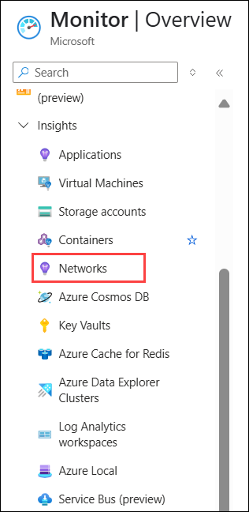
   
1. On the **Network health** tab, you can customize the resource health and alerts view using filters such as **Subscription**, **Resource Group**, and **Type**. You can also use the search box to find resources and their associated resources. For example, a public IP may be associated with an application gateway. A search for the public IP's DNS name will return both the public IP and the associated application gateway.

   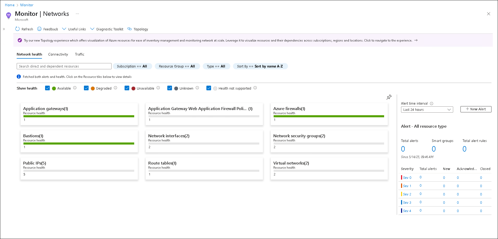

1. In this, each tile represents a resource's health. The tile displays the number of instances of that resource health deployed across all selected subscriptions. 

   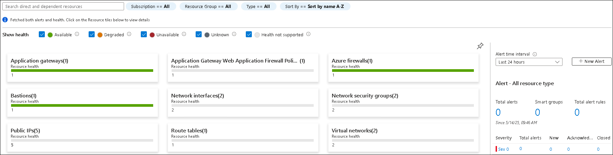

1. You can click on any resource to select the resource view. The resource view helps you visualize how a resource is configured. The resource view is currently available for **Azure Application Gateway**, **Azure Firewall**, and **Bastions**. For example, for Application Gateway, you can access the resource view by selecting the Application Gateway resource name in the metrics grid view. You can do the same thing for Azure Firewall and Bastions.

   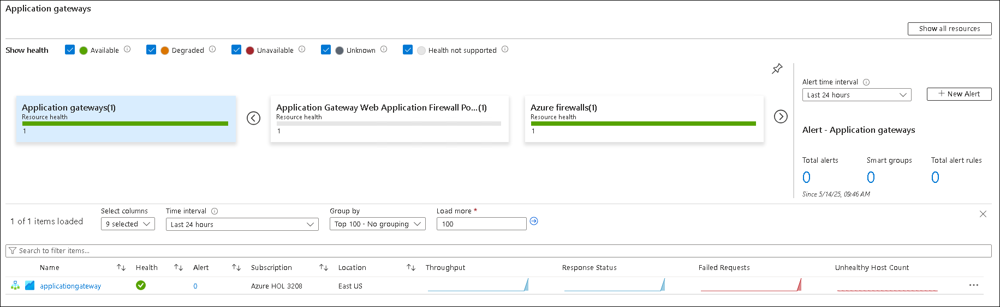

1. Click on the **Throughput** icon next to the location to bring up the Metrics.
   
    
     
1. You will see the **Metrics** as given below:

    

## Task 2: Network Topology

 In this task, you'll view resources in a Microsoft Azure virtual network and the relationships between the resources.

1. Navigate to the Azure portal. Using the search bar, search for **Network Watcher (1)** and **select (2)** from the suggestions.

   

1. From the sidebar, select **Topology** from Monitoring.

   

1. On the **Topology** page, click on the **Scope** **(1)**.

   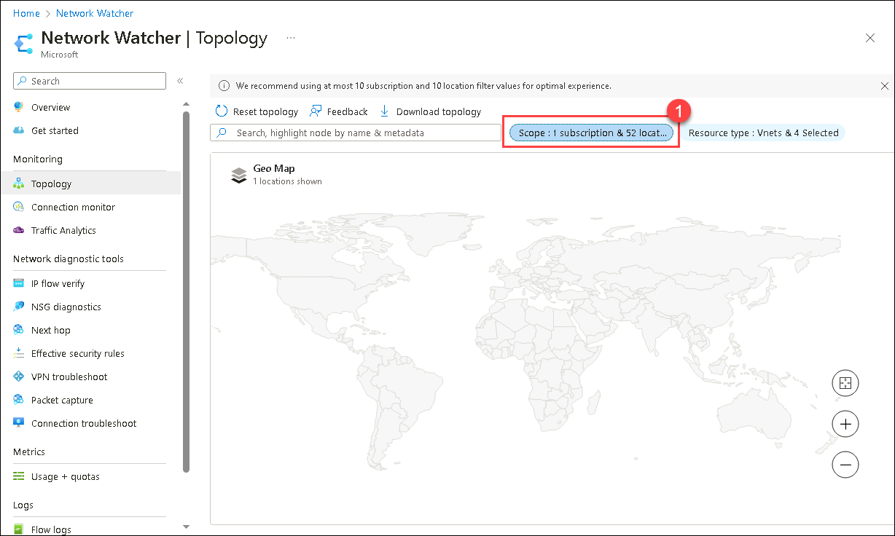

1. Under the **Select Scope** choose the **All subscriptions selected** **(1)** for Subscriptions, **All resource groups selected** **(2)** for Resource Groups, and **<inject key="Region" />** **(3)** for the Locations and then click on **Save**.

   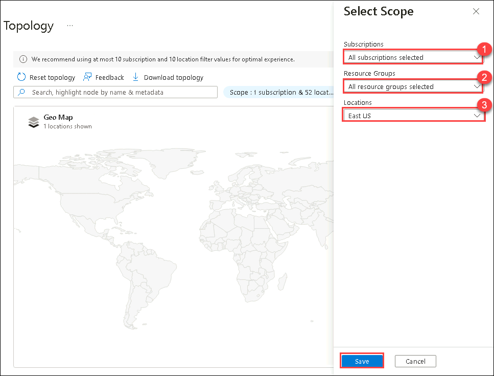

1. Hover the mouse on the location pointer inside **Geo Map** and then click **Expand** to see the topology.

   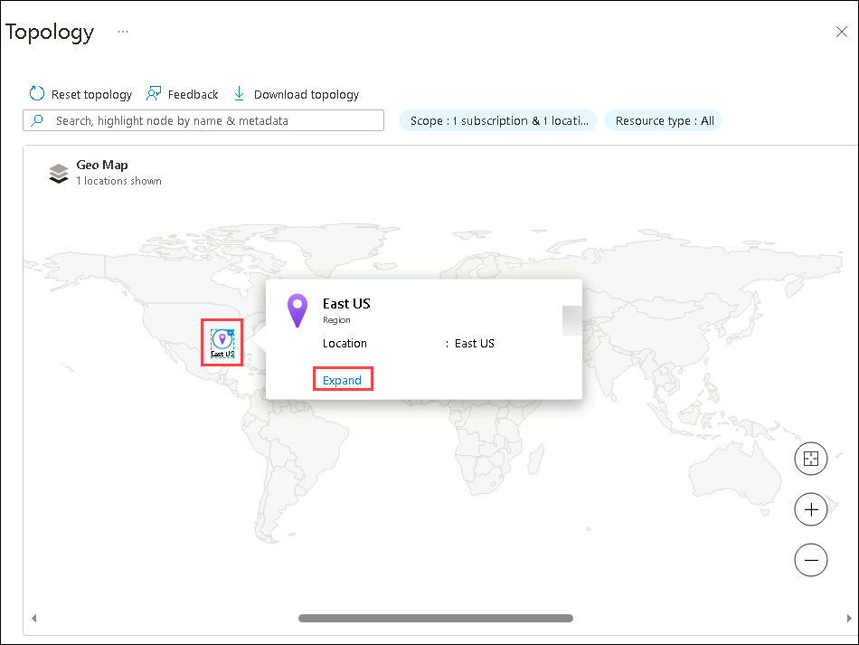

1. Now, you'll be able to **Visualize (1)** the topology. You can explore the different connections to understand how different resources, such as virtual machines, subnets, virtual network gateways, and other network components are interconnected and how they communicate with each other. You can also download the topology by clicking on **Download topology (2)**.

   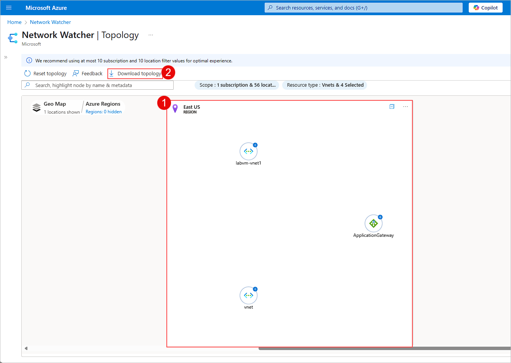

## Task 3: Secure Access via Bastion Host

In this task, you'll learn how to access an Azure virtual machine using the Azure Bastion service.

1. Navigate to the Azure portal. Using the search bar, search for **Virtual networks (1)** and **select (2)** from the suggestions.

   

1. Select the **vnet** from the list.

   

1. From the sidebar, select **Subnets** from Settings.
   
   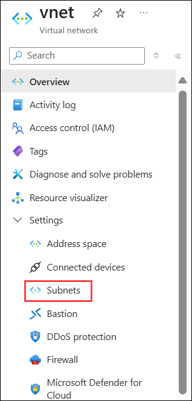

1. You will see that **AzureBastionSubnet** is already present in the subnets. If you want to see the subnet configuration, then you can click on the AzureBastionSubnet subnet and explore this.

   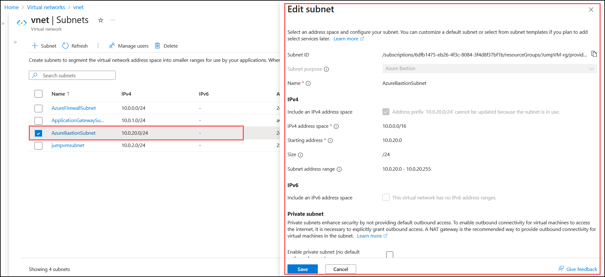

1. Now, using the search bar, search for **Virtual machines (1)** and **select (2)** from the suggestions.

   

1. Select the **FirewallVM** from the list.

   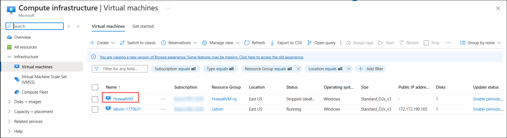

1. On the Virtual Machine page, click on **Connect (1)** under **Connect** and then click on **Go to Bastion (2)**.
 
   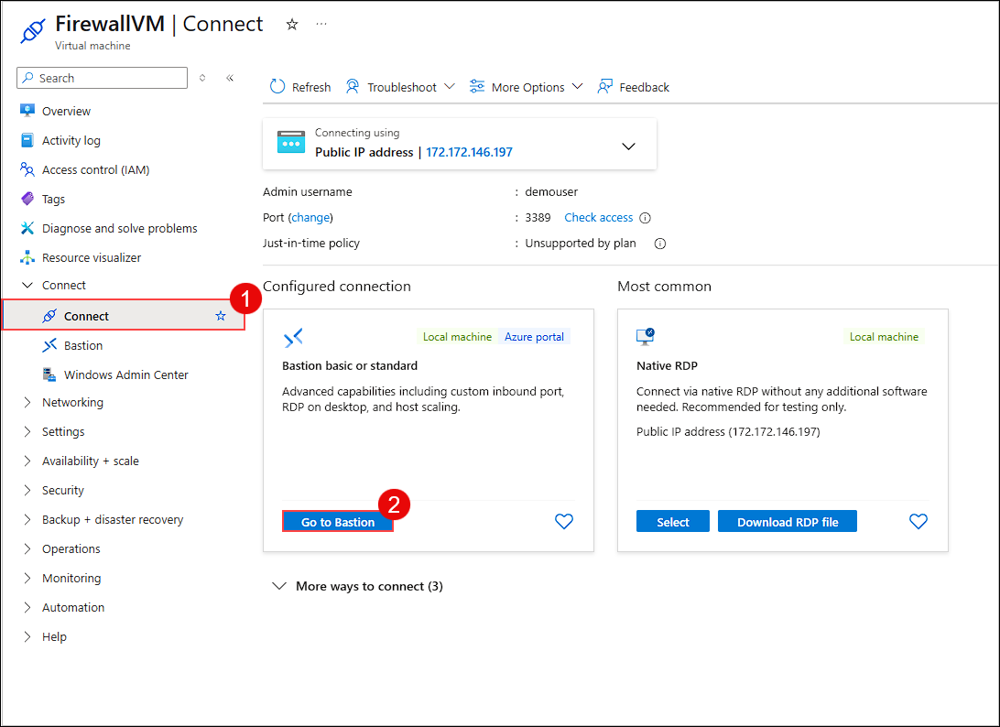
 
1. On the Bastion page, follow the instructions below to connect to the Virtual Machine using Bastion:

    - **Authentication Type:** Select **VM Password (1)** from the drop-down
    
    - **Username:** Enter **<inject key="JumpVM Admin Username" />**  **(2)**
    
    - **VM Password:** Enter **<inject key="JumpVM Admin Password" />**  **(3)**
    
    - Click on **Connect (4)**
 
      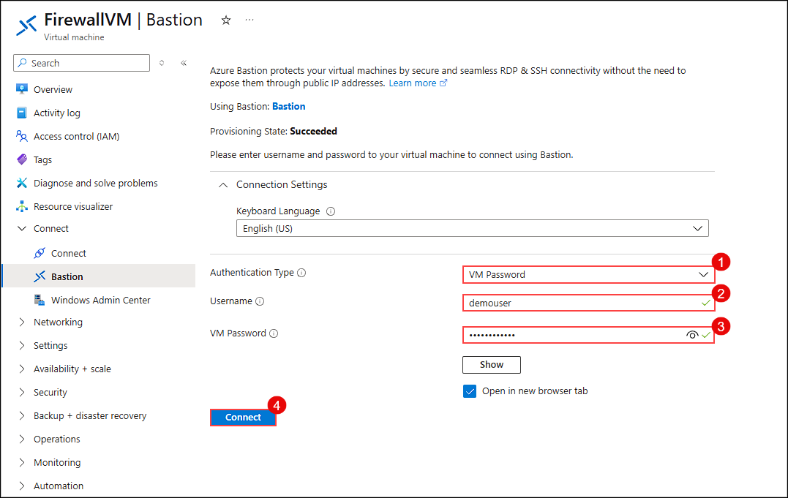

      >**Note:** If the Connection is blocked by the browser, click on the **Pop-up (1)** button, select **Always allow pop-ups and redirects from https://portal.azure.com (2)** and then click on **Done (3)**.

       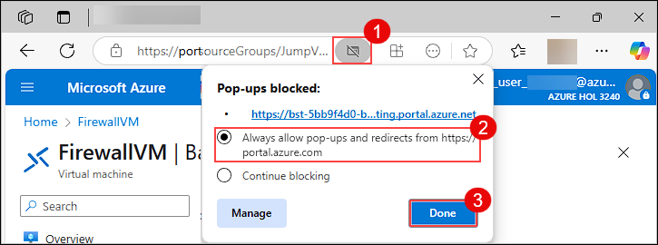
 
1. Now, you will be redirected to a new tab where the Bastion VM is opened. If you see the pop-up **See text and images copied to the clipboard**, click on **Allow**.
 
    

## Task 4: Prepare the Network Watcher monitoring environment and NSG Flow

**NSG Diagnostic Logs** provide detailed information about the health and performance of a Network Security Group. These logs include data related to the configuration changes, rules evaluation, and the overall state of the NSG. Diagnostic Logs can help identify issues with NSG rules, detect unauthorised access attempts, and monitor the NSG's behaviour.

**NSG Flow Logs** capture information about the network traffic flowing through a Network Security Group. They provide visibility into the network communications and can be used for analyzing network behaviour, detecting threats, and investigating security incidents.

In this task, you will create NSG flow logs that will provide detailed information about the network traffic that passes through your NSG. This information can be used for troubleshooting network connectivity issues, monitoring and analyzing network traffic patterns, and detecting potential security threats.

1. Navigate to the Azure portal. Using the search bar, search for **Resource groups (1)** and **select (2)** from the suggestions.

    

1. Select the **FirewallVM-rg** from the list.

    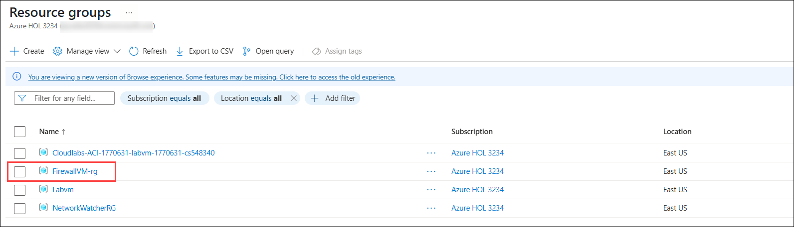

1. From the list of resources, select the Network Security Group named **FirewallVM-nsg**.

    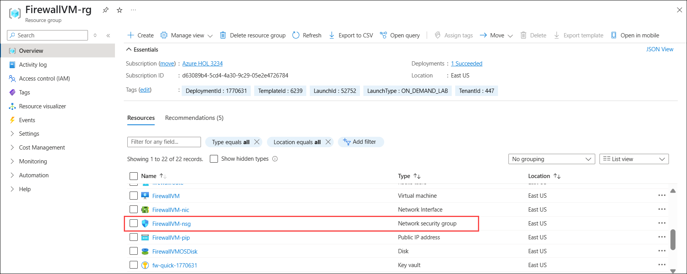

1. Under **Monitoring** section, select **NSG flow logs (1)** blade and Click on **+ Create (2)** button.

    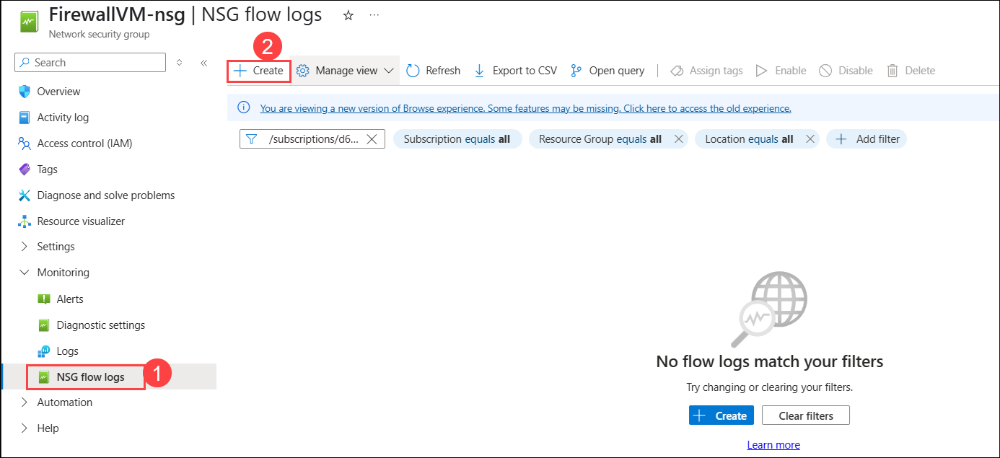

1. In the Create a flow log page, select the **default subscription (1)**, **Network security group (2)** as Flow log type, and **Network security group (4)** as a Select target resource.

    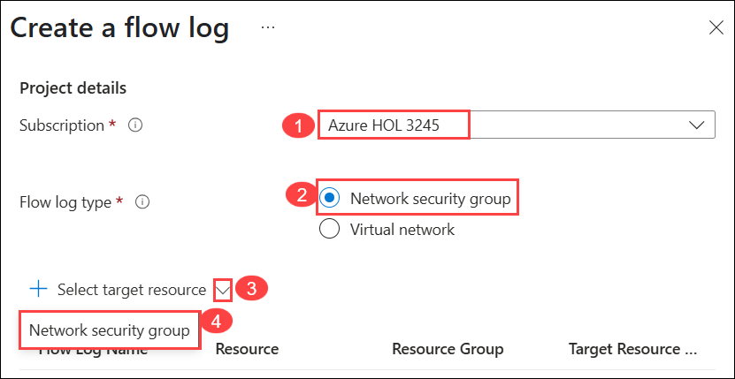

1. In the Select network security group page, select **FirewallVm-nsg** **(1)** and click on **Confirm selection (2)**.

    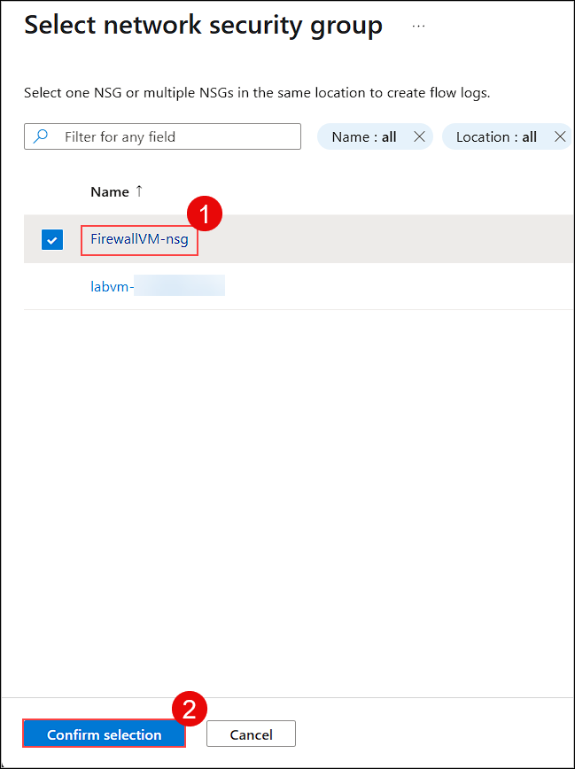

1. For the Instance details, provide the following details and click on **Next: Analytics > (4)**

   - **Subscription:** Select **default subscription (1)** from the drop-down.

   - **Storage Account:** Select **nsglogs<inject key="DeploymentID" enableCopy="false" />** from the drop down.

   - **Retention (days):** **30 (3)**

       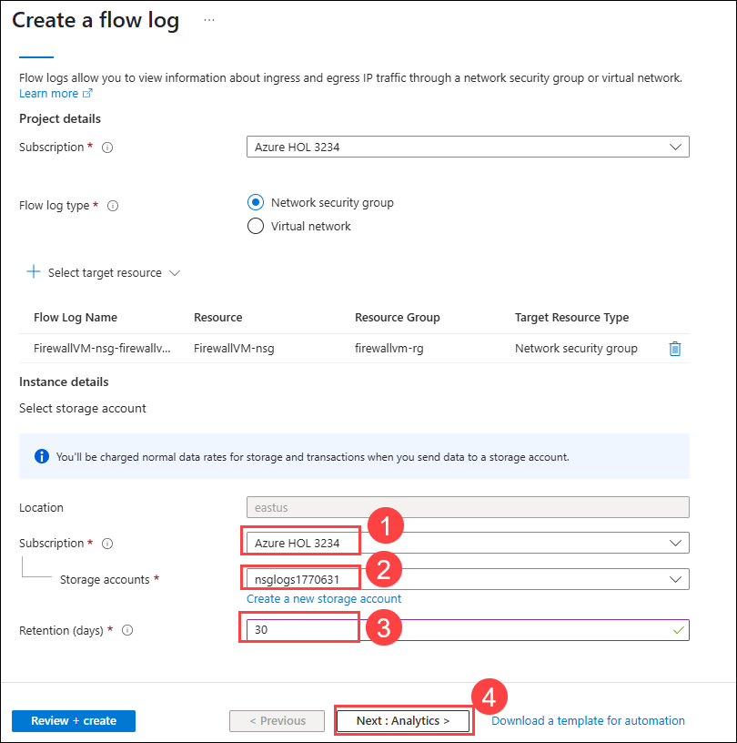  
   
1. Under the **Analytics** tab, check the box to **Enable traffic analytics (1)**, select **Every 10 mins (2)** under the Traffic analytics processing interval and click **Review + create (3)**.

    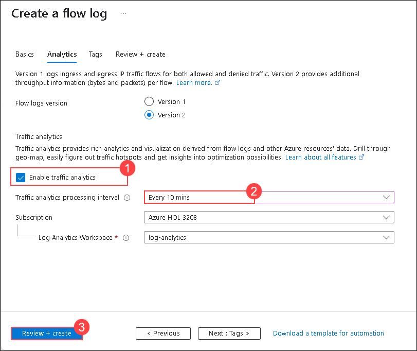

1. On the Review + create tab, review the summary and click on **Create** button.

   >**Note:** The deployment might take a few minutes to complete. Wait till the deployment is completed before proceeding to the next step.

   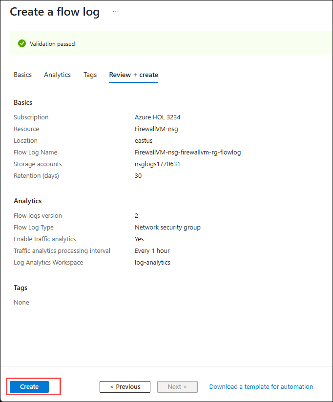  

1. Navigate to the Azure portal. Using the search bar, search for **Resource groups (1)** and **select (2)** from the suggestions.

    

1. Select the **FirewallVM-rg** from the list.

    

1. From the list of resources, select the Network security group named **FirewallVM-nsg**.

    

1. From the sidebar, select **Diagnostic settings (1)** under monitoring and click on **+ Add diagnostic setting (2)**.

    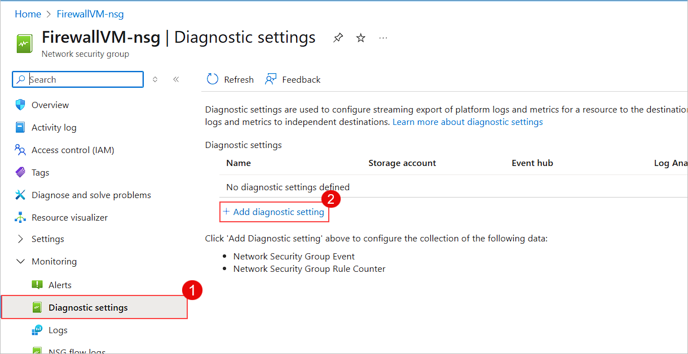

1. In the Diagnostic settings page, provide the following details.

   - Diagnostic setting name: **NSG_Flow_Logs (1)**

   - **Logs -> Category groups:** check the **allLogs (2)** checkbox.

   - **Destination details:** Select **Send to Log Analytics workspace (3)**. The existing log analytics workspace should be selected. Also select the **Archive to a storage account (4)** checkbox, and click on **Save (5)**. Make sure the default subscription is selected for subscription and nsglogs<inject key="DeploymentID" enableCopy="false" /> for a storage account.

      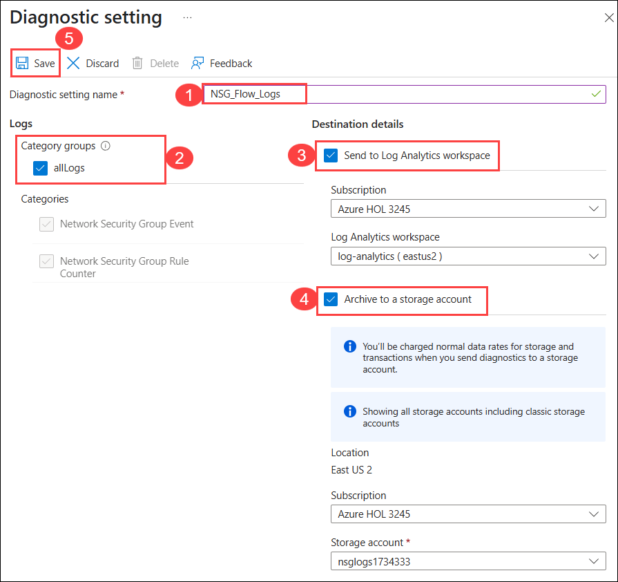

> **Congratulations** on completing the task! Now, it's time to validate it. Here are the steps:
> - If you receive a success message, you can proceed to the next task.
> - If not, carefully read the error message and retry the step, following the instructions in the lab guide. 
> - If you need any assistance, please contact us at cloudlabs-support@spektrasystems.com. We are available 24/7 to help you out.

<validation step="f287d359-99b1-4b6c-8519-647983bf4a68" />

## Summary
 
In this exercise, you have covered the following:
  
- Explored Network health 
- Explored on Network topology
- Secured Access via Bastion Host
- Configured the Network Watcher monitoring environment and NSG Flow

### Click on **Next >>** to proceed with next exercise.
