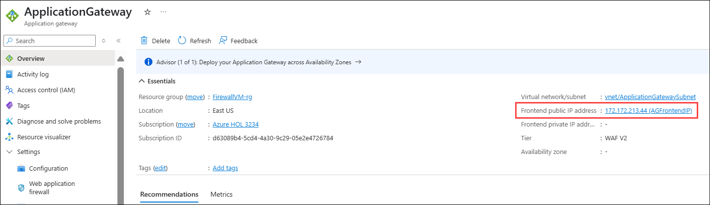
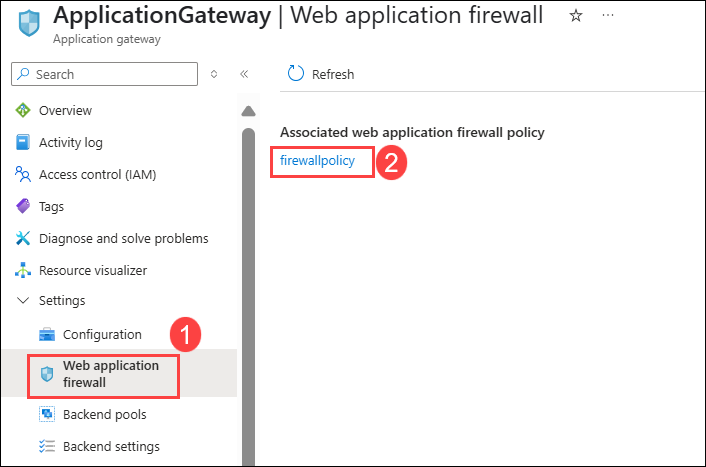
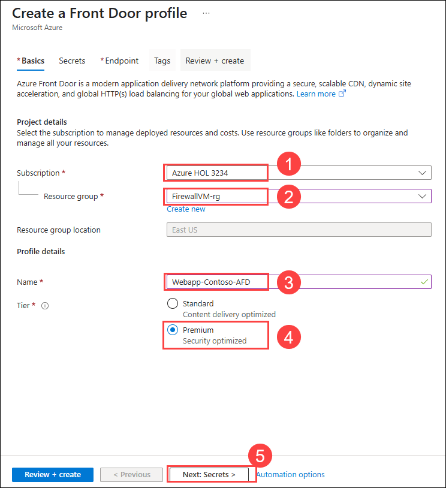
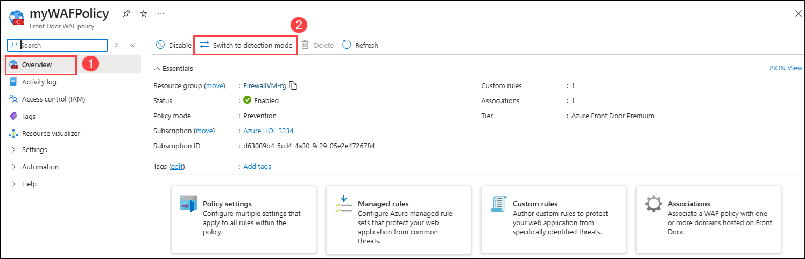

# Exercise 2: Secure application 

### Estimated Duration: 120 Minutes

## Overview

Azure Firewall is a managed, cloud-based network security service that protects your Azure Virtual Network resources. It's a fully stateful firewall as a service with built-in high availability and unrestricted cloud scalability. To learn more about Azure Firewall, refer: `https://docs.microsoft.com/en-us/azure/firewall`

Azure Application Gateway is a web traffic load balancer that enables you to manage traffic to your web applications. Traditional load balancers operate at the transport layer (OSI layer 4 - TCP and UDP). To learn more about Application gateway, refer: `https://docs.microsoft.com/en-us/azure/application-gateway`

Azure Web Application Firewall provides centralized protection of your web applications from common exploits and vulnerabilities. Web applications are increasingly targeted by malicious attacks that exploit commonly known vulnerabilities. SQL injection and cross-site scripting are among the most common attacks. Preventing such attacks in application code is challenging. It can require rigorous maintenance, patching, and monitoring at multiple layers of the application topology. A centralized web application firewall helps make security management much simpler. To learn more about Azure Web Application Firewall, refer: `https://docs.microsoft.com/en-us/azure/application-gateway`

In this lab, you will deploy an Azure Firewall and Application Gateway with WAF V2, then you will publish an application through it. You'll also test the security of the application and perform a sample attack.

## Lab Objectives

You will be able to complete the following tasks:

- Task 1: Configure WAF to protect your web application
- Task 2: Accessing your application using the application gateway
- Task 3: Application Gateway WAF Custom Rule to block IP
- Task 4: Attack simulation
- Task 5: Rate Limiting using Azure Front Door

## Task 1: Configure WAF to protect your web application
 
In this task, you will add a Virtual Machine as the Backend pool of the Application Gateway and also configure the Application Gateway from the firewall policy.
 
 1. From the Azure **Home** page, search for **Application gateways (1)** from the search bar and select **Application gateways (2)**.
 
      
    
 1. Select your **Application Gateway**.

      
      
 1. On the Application gateway page, click on the **Backend pools (1)** under **Settings** and then select **AGBackendtarget (2)**.

     
     
 1. On the **Edit backend pool** page, follow the instructions below:

    - **Target type:** Select **Virtual Machine (1)** from the drop-down.

    - **Target:** Select **FirewallVM-nic (2)** from drop-down.

    - Click on **Save (3)**.

      
    
1. Once the Backend pools are saved, you will see the notification that says **Deployment succeeded**.

   

1. Navigate back to the home page and search for **Application Firewall Policies (1)** from the search bar and select **Web Application Firewall Policies (WAF) (2)**.

   
 
1. On the Web Application Firewall page, click on **Firewall policy**, then navigate to the **Settings** section and select **Associated application gateways**.

   
     
1. On the **Associated application gateways** page, click on **+ Add association (1)** and select **Application Gateway (2)**

    
    
1. Under the **Associate an application gateway** page, follow the instructions below:

    - **Application Gateway (WAF v2 SKU):** Select **Application Gateway (1)** from the drop down. 
    
    - **Check** the box next to **Apply the Web Application Firewall policy configuration even if it's different from the current configuration (2)**.
    
    - Click on **Add (3)**.

      

1. Once the Application Gateway are saved, you will see the notification that says **Updated the Application Gateway**.

   

## Task 2: Accessing your application using the application gateway
 
In this task, you will access the application by going through the Application Gateway that you just configured.

1.  In the Azure **Home** page, from the search bar search for **Application gateways (1)** and then select **Application gateways (2)**.
 
     
 
1. Select your **Application Gateway**.
 
     
 
1. Select the **Frontend public IP address** of the application gateway.
 
      

1.  Copy the **IP address** and save it to Notepad for later use.

     
          
1. Now, to test the application copy and paste the Frontend public IP address of **Application Gateway** into a new browser tab that you copied in previous step.

   
       
## Task 3: Application Gateway WAF Custom Rule to block IP
 
In this task, you will block access from the Lab VM to the Jump VM by configuring a Firewall Policy custom rule. The rule will deny access to the web application by adding the Lab VM’s Public IP in the deny rule.
 
1. In the Azure portal, search for **Virtual machines (1)** and select it from the results **(2)**.

    
 
1. On the **Compute Infrastructure | Virtual machines page**, select **labvm-<inject key="Deployment ID" enableCopy="false"/>**.

    

1. Copy the **Public IP address** and save it to Notepad for later use.

    

1. In the Azure Portal Search **WAF (1)** and then select **Web Application Firewall policies (WAF) (2)**.
 
   
 
1. On the Web Application Firewall policies (WAF) page, select **firewallpolicy (1)**.

    

1. Select **Custom rules (1)** under the **Settings** section, then click on **+ Add custom rule (2)**.
 
    
 
1. On the **Add custom rule** blade, enter the following details:
 
    - Custom rule name: **WAFcustomrule (1)**
    
    - Rule type: Select **Match (2)**
    
    - Priority: Enter **1 (3)**.
    
    - IP address or range: Enter the **Public IP address (4)** of the labvm that is copied above in step 3.
    
    - Click on **Add (5)**.
 
      
 
1. Click on **Save**.
 
   

1. Once the custom rule is created, you will see the notification that says **Successfully updated the WAF policy**, as shown below.
 
   

1. To make your application more secure, select **ApplicationGateway** from the overview page of the resource group.
     
   
    
1. Under the **Application gateway** page, follow the details below:

    - Select **Web application firewall (1)** under **Settings**.    
     
    - Click on **firewallpolicy (2)** under **Associated web application firewall policy**.  
  
      
 
1. On the **firewallpolicy** page, go to the **Overview (1)** tab and click on **Switch to prevention mode (2)**.

   >**Note:** Wait for the firewall policy to get updated before proceeding to the next step.
 
    

1. Navigate back to the browser tab where you accessed the application gateway website and **refresh** the tab; you will no longer be able to see the website.

   

   >**Note:** This may take a few minutes to take effect. 

1. Navigate back to **firewallpolicy** page, go to the **Overview (1)** blade and click on **Switch to detection mode (2)**.

   

> **Congratulations** on completing the task! Now, it's time to validate it. Here are the steps:
> - If you receive a success message, you can proceed to the next task.
> - If not, carefully read the error message and retry the step, following the instructions in the lab guide. 
> - If you need any assistance, please contact us at cloudlabs-support@spektrasystems.com. We are available 24/7 to help you out.

<validation step="09e5a606-3e3a-4e3a-bc6b-93380fcde756" />

## Task 4: Attack simulation
     
In this task, you will be testing your application for security and performing sample attacks like XSS. Cross-site scripting (XSS) attacks are a type of injection in which malicious scripts are injected into otherwise benign and trusted websites. XSS attacks occur when an attacker uses a web application to send malicious code, generally in the form of a browser-side script, to a different end-user.

Since we are already blocking the Public IP of the Lab VM from accessing the web application. You will want to perform this test from your own machine’s browser. You can perform a sample attack on your application by passing this `?q=<script>` value at the end of the web application URL or IP address.

1. From your own machine's browser, access the application by putting in the **Application Gateway IP** that you looked up in Task 2.
   
    >**Note:** Your browsing URL value should look like ```https://20.169.169.81/```

     

1. Now pass the value `?q=<script>` at the end of your **Application Gateway** IP and try browsing it using browser. You can observe that the web application is accessible.
  
    >**Note:** Your browsing URL value should look like ```http://20.169.169.81/?q=<script>```
    
     
  
1. To make your application more secure, select **ApplicationGateway** from the overview page of the resource group.
     
    
    
1. On the **Application gateway** page, follow the details below:

    - Select **Web application firewall (1)** under **Settings**.    
     
    - Click on **firewallpolicy (2)** under **Associated web application firewall policy**.  
  
      
 
1. On the **firewallpolicy** page, go to the **Overview (1)** blade and click on **Switch to prevention mode (2)**.

     >**Note:** Wait for the firewall policy to get updated before proceeding to the next step.

    
    
1. Now, navigate back to the tab where you browsed the IP Address and refresh the page. You can observe the **403 Forbidden error**.
    
    

     >**Note:** This may take a few minutes to take effect.

## Task 5: Rate Limiting using Azure Front Door
  
In this task, you will set up an Azure Front Door configuration that pools two instances of a web application that runs in different Azure regions. This configuration directs traffic to the nearest site that runs the application. Azure Front Door continuously monitors the web application. You will demonstrate automatic failover to the next available site when the nearest site is unavailable. The network configuration is shown in the following diagram:  
  

  
### Task 5.1: Create a Front Door for your application

Configure Azure Front Door to direct user traffic based on the lowest latency between the two Web Apps' origins. You'll also secure your Azure Front Door with a Web Application Firewall (WAF) policy.
  
1. In the Azure portal, search for **Front Door (1)** and select **Front Door and CDN profiles (2)** from the results.
  
    
  
1. Select **+ Create** to create a Front Door and CDN profile.
  
    

1. On the **Compare offerings** page, select **Custom create**. Then select **Continue to create a Front Door**.
  
    
  
1. On the **Basics** tab, enter or select the following information, and then select **Next: Secret > (5)**.
  
    | **Setting**                 | **Value**                                                     |
    | ----------------------------| ------------------------------------------------------------  |
    | Subscription                | Select your subscription (1).                                     |
    | Resource group              | Select the resource group **JumpVM-rg (2)**                       |
    | Resource group location     | <inject key="Region" />                                |
    | Name                        | Enter **Webapp-Contoso-AFD (3)**                                  |
    | Tier                        | Select **Premium (4)**                                            |
  
    
  
1. On the **Secrets** tab, Leave it default as same and click on **Next: Endpoint >**.
  
    
  
1. On the **Endpoint** tab, select **Add an endpoint (1)**.

    

1. Now, name the endpoint as **contoso-frontend (1)** and click on **Add (2)** to add the endpoint.
  
    
  
1. On the same page, select **+ Add a route** to configure routing to your Web App origin.
  
    
  
1. On the **Add a route** page, enter name as **myRoute (1)** and click on **Add a new origin group (2)**.
  
    
  
1. On the **Add an origin group** pane, enter name as **myOriginGroup (1)** and click on **+ Add an origin (2)**.
  
    
  
1. To add the first origin, enter **OWASP-Main (1)** as the name, select **App services (2)** as the origin type, choose **owasp-mainjump<inject key="DeploymentID" enableCopy="false" />.azurewebsites.net (3)** as the host name, then click **Add (4)**.
  
    

1. To add the second origin, enter **OWASP-Stage (1)** as the name, select **App services (2)** as the origin type, choose **owasp-stage<inject key="DeploymentID" enableCopy="false" />.azurewebsites.net (3)** as the host name, then click **Add (4)**.
  
    
  
1. Click on **Add**.
  
    
  
1. Again, select **Add** to add a route.
  
    
  
1. Select **+ Add a policy** to apply a Web Application Firewall (WAF) policy to one or more domains in the Azure Front Door profile.
  
    
  
1. On the **Add security policy** page, enter the name **mySecurityPolicy (1)**. Then select the **Domains (2)** you want to associate with the policy from the dropdown. For the WAF Policy, choose **Create New**, enter the policy name as **myWAFPolicy (3)**, and click **Create (4)**. Finally, select **Save (5)** to add the security policy to the endpoint configuration.
  
     
  
1. Select **Review + create**, review the summary, and then select **Create** to deploy the Azure Front Door profile. The configuration will take a few minutes to propagate to all edge locations.

    > **Note:** Wait for the deployment to complete, which may take a few minutes, before proceeding to the next task.

    
   
    
  
### Task 5.2: View Azure Front Door in action
  
Once you create a Front Door, it takes a few minutes for the configuration to be deployed globally. Once complete, access the frontend host you created.
  
1. On the Front Door resource, go to the **Overview (1)** blade and locate the endpoint hostname created for your endpoint, for example, **contoso-frontend-ghbnd2bafvhmbzfs.z01.azurefd.net**. Then, **copy (2)** this FQDN.
  
    
    
1. In a new browser tab, navigate to the Front Door endpoint FQDN. The default App Service page will be displayed.
  
    
   
    > **Note:** The application might take around 5 minutes to reflect. You can continue with the next task and come back later to refresh the page to see the changes.
   
1. To test instant global failover in action, follow these steps (**Step 3 to Step 8 are optional**):

1. Navigate to the Azure portal, search for, and select **App Services**.
  
    

1. Select one of your web apps, click **Stop**, and then click **Yes** to confirm.

    

1. Switch back to your browser and select **Refresh**. You should see the same information page.

    
    
    > **Note:** There may be a delay while the web app stops. If you see an error page in your browser, simply refresh the page.
  
1. Switch back to the Azure Portal, locate the other web app, and stop it.
  
    

1. Switch back to your browser and select Refresh. This time, you should see an error message.

    

### Task 5.3: Create a Rate Limit Rule
  
1. Navigate to the **App Services** tab, select both of your web apps, click **Start**, and then click **Yes** to confirm.
  
    

1. In a new browser tab, paste the **endpoint** you copied in the previous task.

    
  
    
  
1. Click on the **magnifying glass** icon in the top right corner of the website to open the search.
  
    
  
1. Type any keyword (e.g., **apple**) into the search box and observe the response from the website. Since the site uses JSON, try refreshing the browser to repeat the search. This time, you will not see any response message as before.
  
    
  
      
  
1. In the Azure portal, search for **myWAFPolicy (1)** and select it from the results **(2)**.
  
    
  
1. On the **myWAFPolicy** page, under **Settings**, select **Custom rules (1)**, then click **+ Add custom rule (2)**.
  
    
  
1. On the **Add custom rule** blade, enter the following details
 
    - Custom rule name: Enter **rateLimitRule (1)**.
    
    - Rule type: Select **Rate limit (2)**
    
    - Priority: Enter **1 (3)**
    
    - Rate limit duration: Select **1 minute (4)**
    
    - Rate limit threshold (requests): Enter **1 (5)**
  
       
 
1. Under Conditions, enter the information required to specify a match condition to identify requests where the URL contains the string `contoso` and `azurefd`:
  
    - Match type: Select **String**.
    
    - Match variable: Select **RequestUri**
    
    - Match values: Enter **contoso** and **azurefd**
    
    - Click on **Add**.
      
       
  
1. Select **Save**.
  
    

1. Return to the **Overview** page of **myWAFPolicy**, then select **Switch to prevention mode** to update the policy's operating mode.

    

    >**Note:** Wait for the firewall policy to get updated before proceeding to the next step.

1. On the **myWAFPolicy** page, under **Settings**, click **Policy settings (1)**. Notice the block response status code is set to **403 (2)**. Enter **This is a rate limit test (3)** under the block response body and click **Save (4)**.
  
        
  
1. Navigate back to the website and try **refresh** in the browser, you will see a response from the website.

    

    >**Note:** It may take a few minutes for the rate limit policy to take effect. You can continue with other tasks and return later to test.

1. After getting the response from the website, navigate back to the **myWAFpolicy** page, go to the **Overview (1)** tab, and click on **Switch to detection mode (2)**.

    

> **Congratulations** on completing the task! Now, it's time to validate it. Here are the steps:
> - If you receive a success message, you can proceed to the next task.
> - If not, carefully read the error message and retry the step, following the instructions in the lab guide. 
> - If you need any assistance, please contact us at cloudlabs-support@spektrasystems.com. We are available 24/7 to help you out.

<validation step="cc732f3b-1c39-4339-b1c4-b43b2b31b193" />

## Summary
 
In this exercise, you have covered the following:
  
- Configured WAF to protect your web application 
- Accessed your application using the application gateway
- Customized WAF rules
- Performed Attack simulation
- Performed Rate Limiting using Azure Front Door

### Click on **Next >>** to proceed with next exercise.
