# Exercise 1- Secure Infrastructure with Azure Firewall Premium

Azure Firewall is a cloud-native and intelligent network firewall security service that provides the best-of-breed threat protection for your cloud workloads running in Azure. It's a fully stateful, firewall as a service with built-in high availability and unrestricted cloud scalability. It provides both east-west and north-south traffic inspection.

Azure Firewall Premium is a next-generation firewall with capabilities that are required for highly sensitive and regulated environments. It includes the following features:

- **TLS Inspection** - decrypts outbound traffic, processes the data, then encrypts the data and sends it to the destination.
- **IDPS** - A network intrusion detection and prevention system (IDPS) allows you to monitor network activities for malicious activity, log information about this activity, report it, and optionally attempt to block it.
- **URL filtering** - extends Azure Firewall’s FQDN filtering capability to consider an entire URL. For example, `www.contoso.com/a/c` instead of `www.contoso.com`.
- **Web categories** - Administrators can allow or deny user access to website categories such as gambling websites, social media websites, and others.
For more information, see `https://learn.microsoft.com/en-us/azure/firewall/premium-features`
 
This exercise includes the following tasks:
  - Configure WAF to protect your web application
  - Add firewall diagnostics settings
  - Test IDPS for HTTP traffic
  - Web categories testing
  - Implement and Test URL filtering
  - IP Groups
  - Azure Firewall Policies with Firewall Manager

 ## **Task 1: Configure WAF to protect your web application**
 
 In this task, you will add a Virtual Machine as the Backend pool of the Application gateway and also configure the Application Gateway from the firewall policy.
 
 1. From the Azure **Home** page, search for **Application gateways (1)** from the search bar and select **Application gateways (2)**.
 
      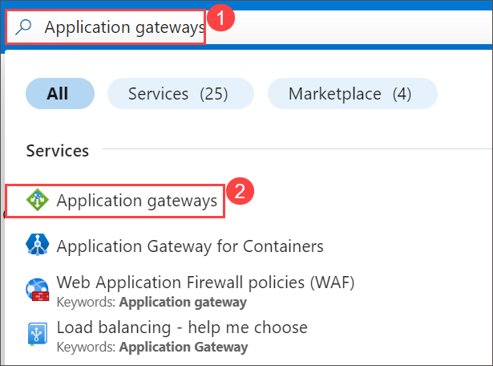
    
 1. Select your **Application Gateway**.

      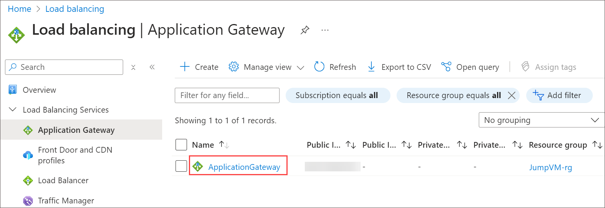
      
 1. On the Application gateway blade click on the **Backend pools(1)** under setting and then select **AGBackendtarget(2)**.

     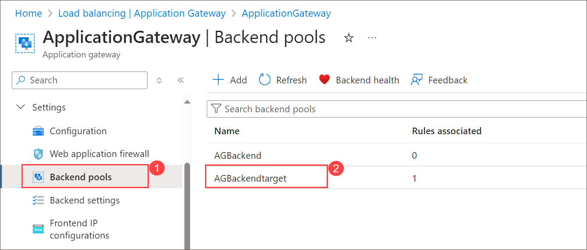
     
 1. On the **Edit backend pool** page, follow the below-mentioned instructions:

    - **Target type**: Select **Virtual Machine (1)** from the drop-down.
    - **Target**: Select **JumpVM-<inject key="Deployment ID" enableCopy="false"/>-nic (2)** from drop-down.
    - Click on **Save (3)**.

      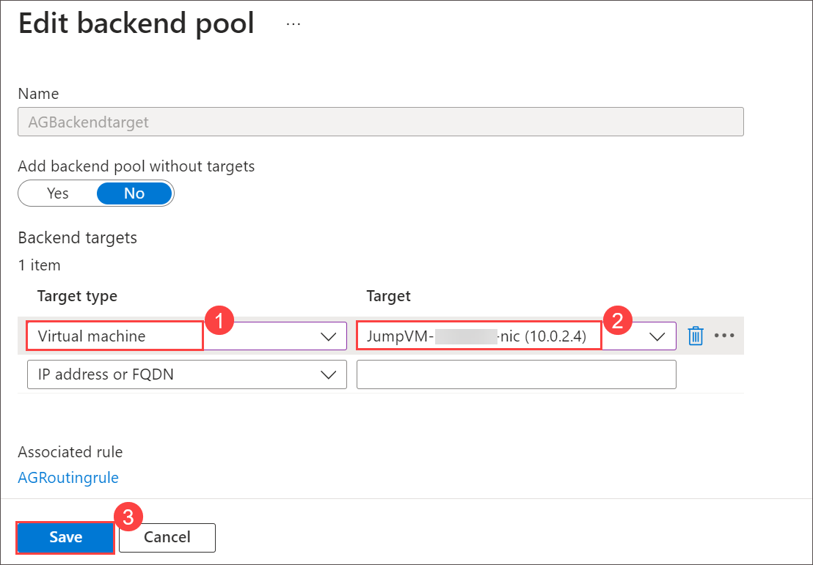
    
1. Once the Backend pools are saved, you will see the notification that says **Deployment Succeeded**.

 1. Navigate back to the home page and search for **Application Firewall Policies (1)** from the search bar and select **Web Application Firewall Policies (2)**.

      
 
 1. Click on **firewallpolicy** under the Web Application Firewall page and click on **Associated application gateways** under the **Settings** tab from the Application Gateway WAF policy page.

     
     
 1. On the **Associated Application gateway** page, click on **+ Add association (1)** and select **Application Gateway(2)**

    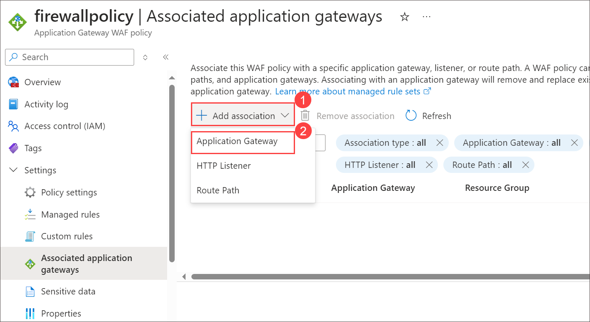
    
 1. Under the **Associate an application gateway** page, follow the below instructions:

    - **Application Gateway (WAF v2 SKU)**: Select **Application Gateway (1)** from the drop down. 
    - **Check** the box next to **Apply the web Application Firewall policy configuration even if it's different from the current configuration (2)**.
    - Click on **Add (3)**.

      

## **Task 2: Add firewall diagnostics settings** 

In this task, you will enable diagnostic settings in Azure Firewall to collect firewall logs.

1. Navigate to the home page in the Azure portal, search for **Subscriptions (1)** and **select (2)** from suggestions.

   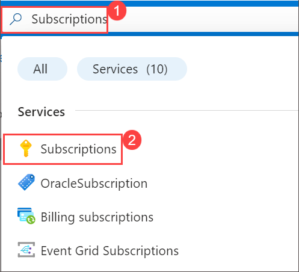

1. Select the **default subscription** available in the list.

   

1. From the left-side blade, select **Preview features (1)** and choose **Provide : All (2)** then on **Provider** window search **(3)** and select **Microsoft Network (4)** and click on **Apply (5)**.

   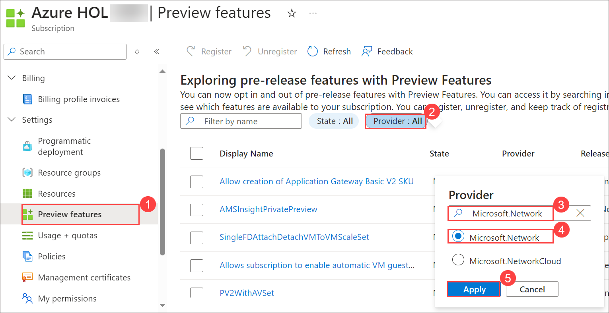

1. Select **Enable Azure Firewall Structured Logs (1)** and click on **Register (2)**.

    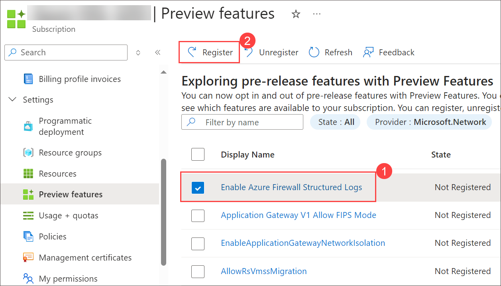

1. Select **OK** when Do you want to register the selected features?.

   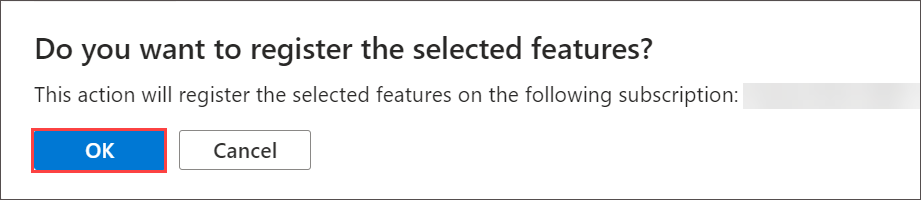

1. In the Azure portal, navigate to your **JumpVM-rg** resource group and select the **AzureFirewall** resource.

   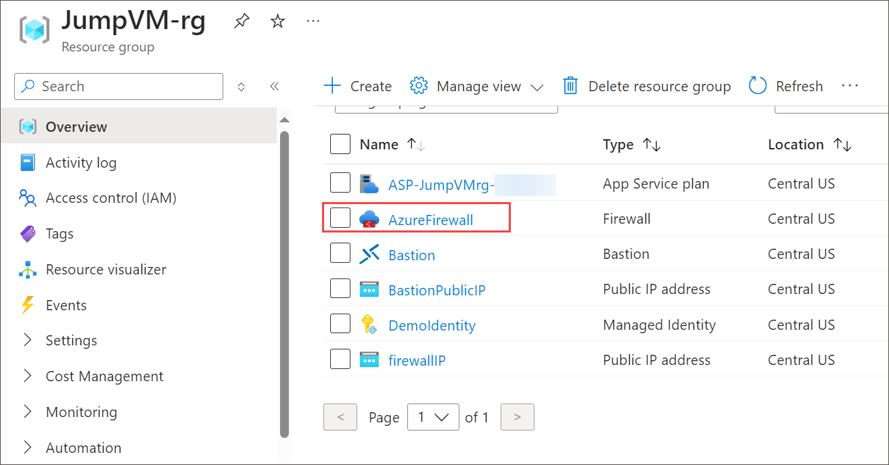

2. On the firewall page, under **Monitoring**, select **Diagnostic settings**.

   

3. Select **Add diagnostic setting** on the **Diagnostic settings**. 

   

4. Enter the **Diagnostic setting name** as **fw-diagnostics**.

    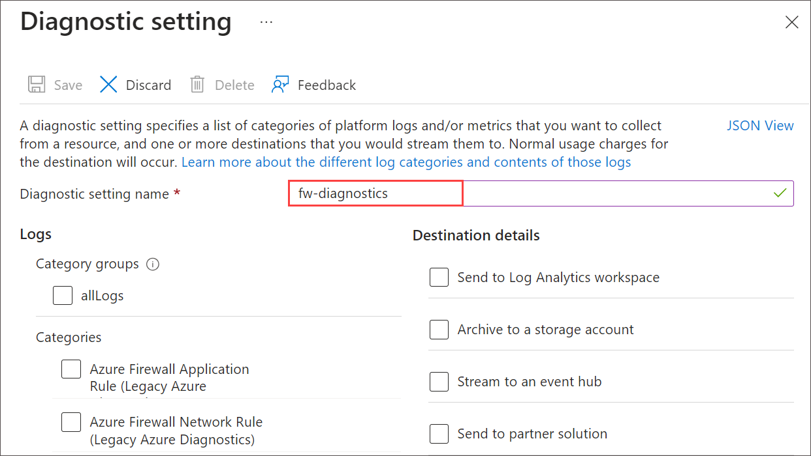

5. Under **Logs**, select the below mentioned categories.
   
   - Azure Firewall Application Rule
   - Azure Firewall Network Rule
   - Azure Firewall Nat Rule
   - Azure Firewall Threat Intelligence
   - Azure Firewall IDPS Signature
   - Azure Firewall DNS query
   - Azure Firewall FQDN Resolution Failure
   - Azure Firewall Fat Flow Log
   - Azure Firewall Flow Trace Log

     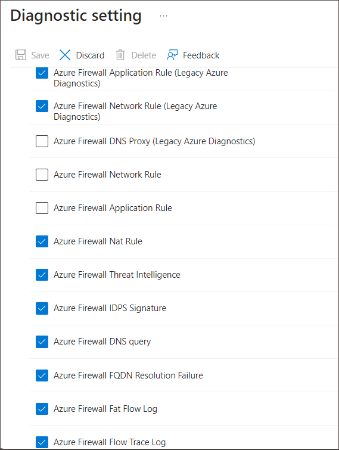

6. Under **Destination details**, select **Send to Log Analytics workspace (1)**, select **Resource specific (2)** for Destination table option, and then click on **Save (3)**.

   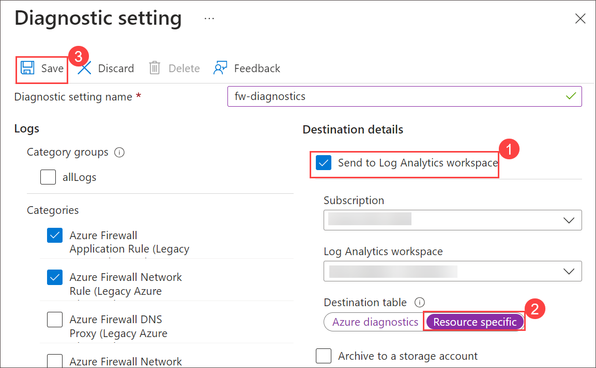

## **Task 3: Test IDPS for HTTP traffic**

Azure Firewall Premium provides signature-based IDPS to allow rapid detection of attacks by looking for specific patterns, such as byte sequences in network traffic, or known malicious instruction sequences used by malware.

In this task, you'll configure Azure Firewall Premium's IDPS (Intrusion Detection and Prevention System) to detect and block malicious HTTP traffic. You'll set up DNAT rules to redirect traffic, simulate an attack using a test VM, and verify the firewall's response through log analysis. Finally, you'll update IDPS signature rules to enforce stricter security measures.

1.  In the Azure **Home** page, from the search bar search for **Application gateways (1)** and then select **Application gateways (2)**.
 
     
 
1. Select your **Application Gateway**.
 
     
 
1. Select the **Frontend public IP address** of the application gateway.
 
      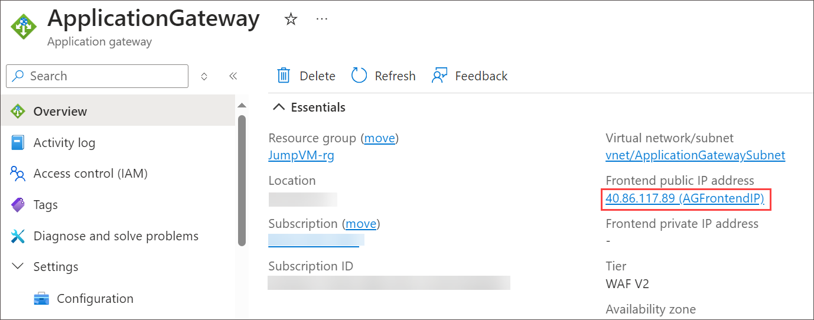

1.  Copy the **Public IP address** and save it to Notepad for later use.

     
    
1. On the Azure Portal **Home** page, search **Firewall (1)** and then select **Firewalls (2)**.

   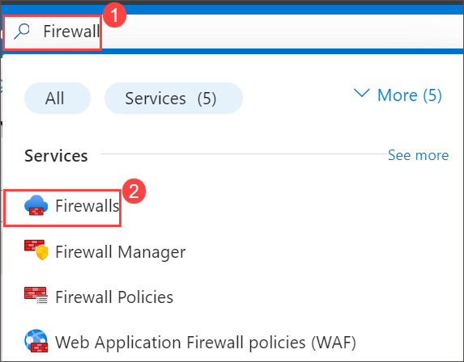
    
1. Click on the **AzureFirewall**.

   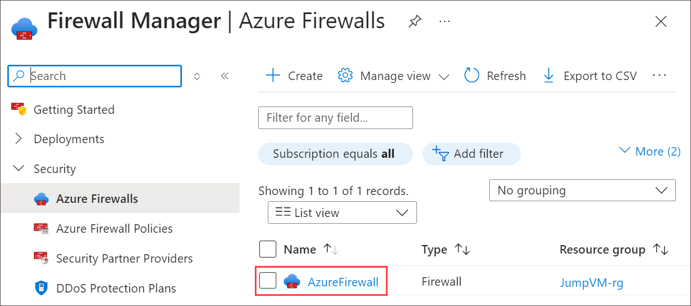
   
1. Select **Firewall Public IP** from the Overview tab.

    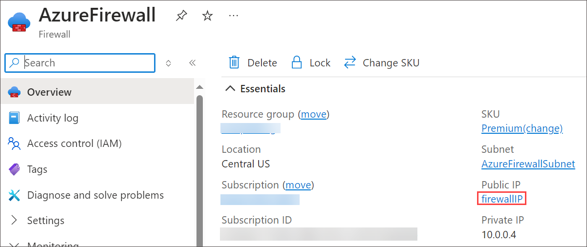
    
1. Copy the **Public IP address** and save it to Notepad for later use.

    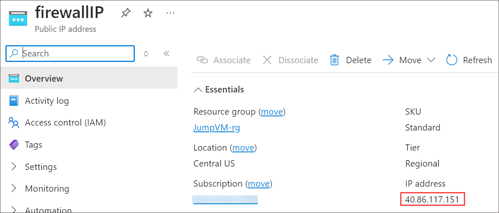
     
1. Navigate back on Azure Firewall, Select **Firewall Manager (1)** from the **Settings** tab, and click on **Visit Azure Firewall Manager to configure and manage this firewall (2)**

   
    
1. Select **Azure Firewall Policies (1)** under the **Firewall Manager** page and click on Firewall Policy **firewallpolicy (2)**.

   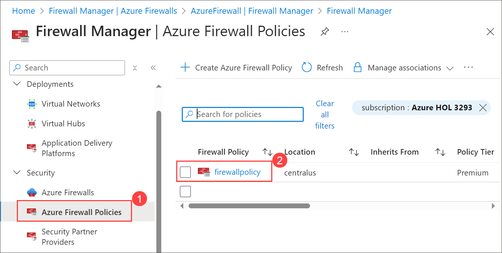
   
1. Select **DNAT Rules (1)** from the **Settings** tab under the **Firewall Policy** page and select **+ Add a rule collection (2)**

   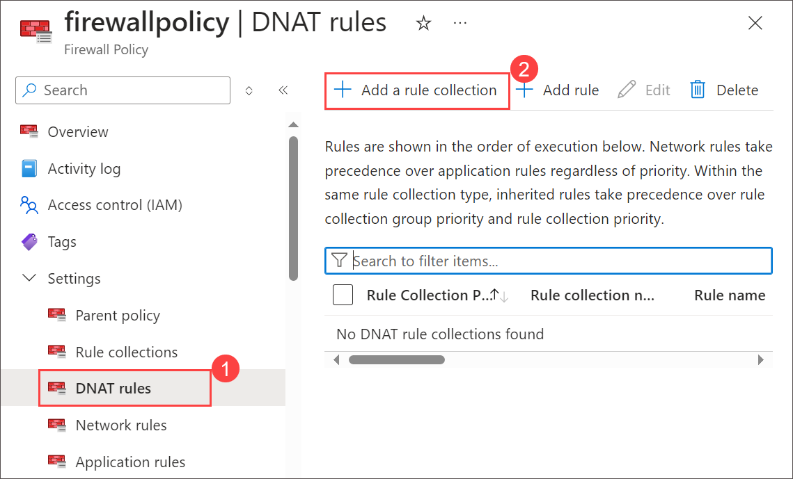
    
1. Under the **Add a rule collection** page, enter the below details:

    - Name: **afw-contoso-prod-firewall-rulecolection (1)**
    - Rule Collection type: **DNAT (2)**
    - Priority: **100 (3)**
    - Rule collection group: **DefaultDnatRuleCollectionGroup (4)**
    - Under **Rules (5)** mention the below details:
      - Name: **afw-dnat-http**
      - Source type: Select **IP Address** from the drop-down list
      - Source: Enter *
      - Protocol: Select **TCP** from the drop-down list
      - Destination Ports: **80**
      - Destination (Firewall PIP address): Enter the IP address of the **Firewall** which you copied in step 8.
      - Translated type: Select **IP Address** from the drop-down list
      - Translated address or FQDN: Enter the Public IP address of the **Application gateway** which you copied in step 4.
      - Translated port: **80**
     
     - Click on **Add (6)**.

       

1. On the JumpVM virtual machine, search for **Command Prompt (1)** and open the **Command Prompt (2)** window.

   

1. Type the following command at the command prompt:

   - Replace <your web server address> with Firewall IP.

     `curl -A "HaxerMen" <Firewall Public IP>`
 
   
 
 1. In the custom prompt you will see your Web server response.
 
    
 
 1. Navigate to your **JumpVM-rg** resource group and select **AzureFirewall**.
 
     
 
 1. On the **AzureFirewall** page, select **Logs (1)** Click **x**

     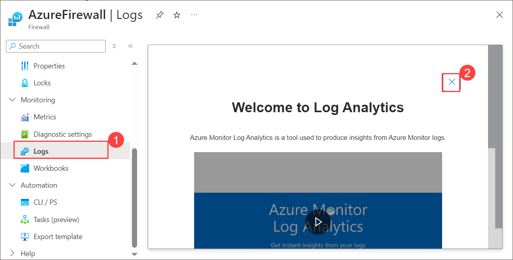

 1. Select **Logs (1)** ,click on **Firewall Logs (Resource Specific Tables - Preview) (2)** and click on **Run (3)** for **IDPS event logs**.
 
     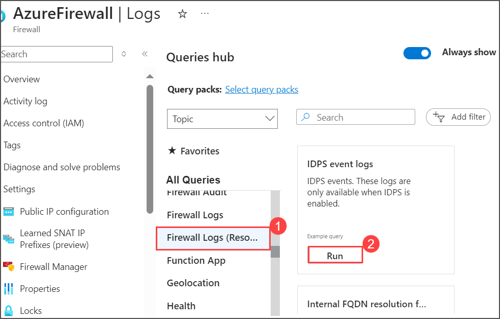
 
 1. You'll be able to see resource-specific logs for IDPS events.
 
    
 
    >**Note: In case you didn't find the Logs as expected, then it may take up to 6 hours to show up. Please refer to the screenshot for reference and continue with the next steps**.

 
1. Now navigate back to **Azure Firewall** from the **JumpVM-rg** and scroll down and select **firewall policy** > **IDPS**.
 
   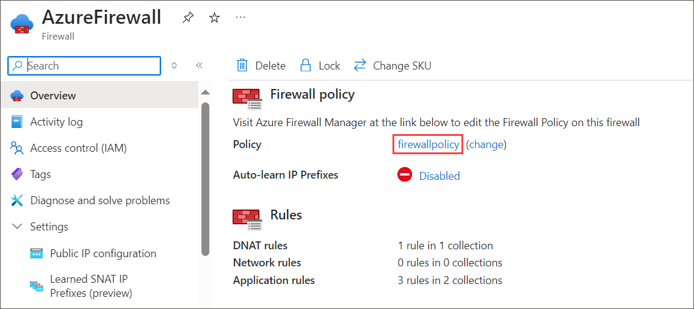
   
   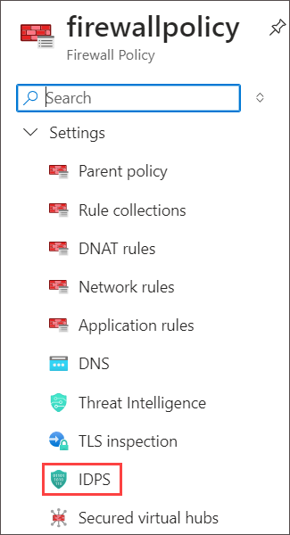
 
1. On the **IDPS** page select the **Signature rules (1)** tab and under **Signature ID**, in the open text box type **2032081 (2)**.
 
   

    >**Note: In case you didn't find the Signature ID continue onto the next task and please try this step after 20-30 mins as it can take sometime to show up.**
 
1. Select **2032081 (1)** signature id and click on **Edit Rules (2)**.
 
   
 
1. Under edit rules, change **Signature Mode** to **Alert and Deny (1)** and click on **Apply (2)**.  Wait for the deployment to complete before proceeding.
 
   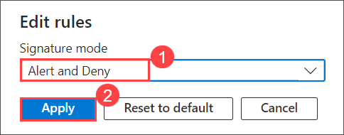

1. Click on **Apply** to update the firewall policy.

   <validation step="400ff3c9-29ed-4768-aed1-b234085208b0" /> 

   > **Congratulations** on completing the lab! Now, it's time to validate it. Here are the steps:
      > - Navigate to the Lab Validation Page, from the upper right corner in the lab guide section.
      > - Hit the Validate button for the corresponding task. If you receive a success message, you can proceed to the next task. 
      > - If not, carefully read the error message and retry the step, following the instructions in the lab guide.
      > - If you need any assistance, please contact us at cloudlabs-support@spektrasystems.com. We are available 24/7 to help you out.

 
## **Task 4: Web categories testing**
 
In this task, you will create an application rule to allow access to sports websites.
 
1. In the Azure portal, navigate to your **JumpVM-rg** resource group and select the Route Table **firewallroute**. 
    
    
 
1. On the Route table page, select **Routes (1)** under **Settings** and click on **+ Add (2)**.
 
    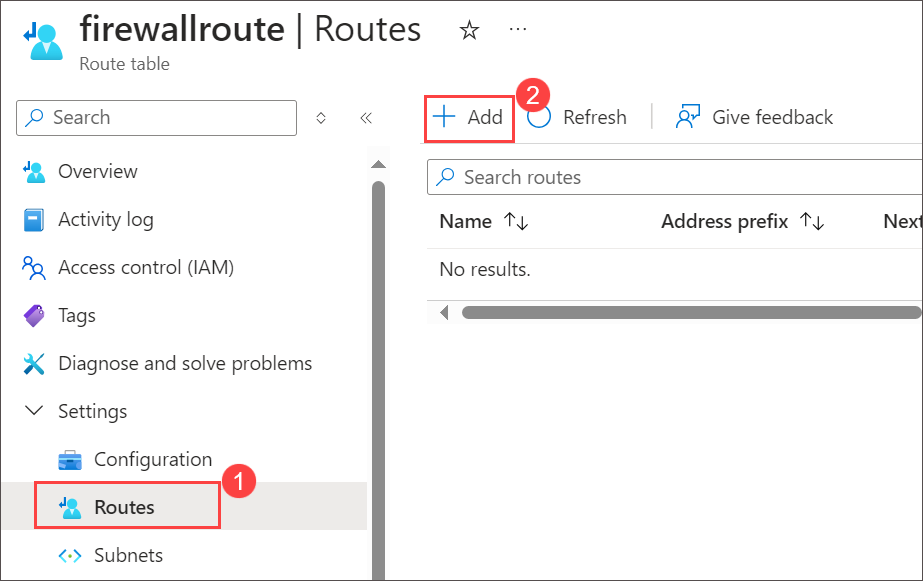
 
1. Under the **Add Route** page, enter the below information:
  
    - Route Name: Enter **firewallroute (1)**
    - Address prefix destination: Select **IP Address (2)** from the drop-down list
    - Destination IP address/ CIDR ranges: Enter **0.0.0.0/0 (3)**
    - Next hop type: Select **Virtual appliance (4)** from the drop-down list
    - Next hop address: Enter the **private IP Address** of the Firewall **(5)**.
    - Select **Add (6)**
 
      
 
 1. Now select **Subnets (1)** and Click on **Associate (2)**.

       - Under Associate subnets, enter the following details:
  
          - Virtual Network: Select **vnet (JumpVM-rg) (3)** from the drop-down list.
          - Subnet: Select **jumpvmsubnet (4)** from the drop-down list.
          - Click on **Ok (5)**.
 
             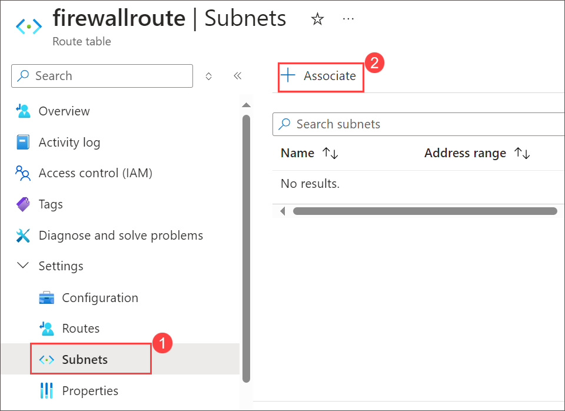

	          
 
1. Navigate to your **JumpVM-rg** resource group and select **JumpVM-<inject key="Deployment ID" enableCopy="false"/>**. 
 
    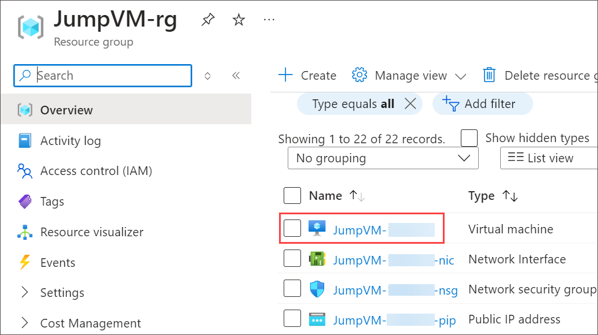

1. On the Virtual Machine page, under **Connect**, click on **Connect (1)** then click on **Go to Bastion (2)**.
 
    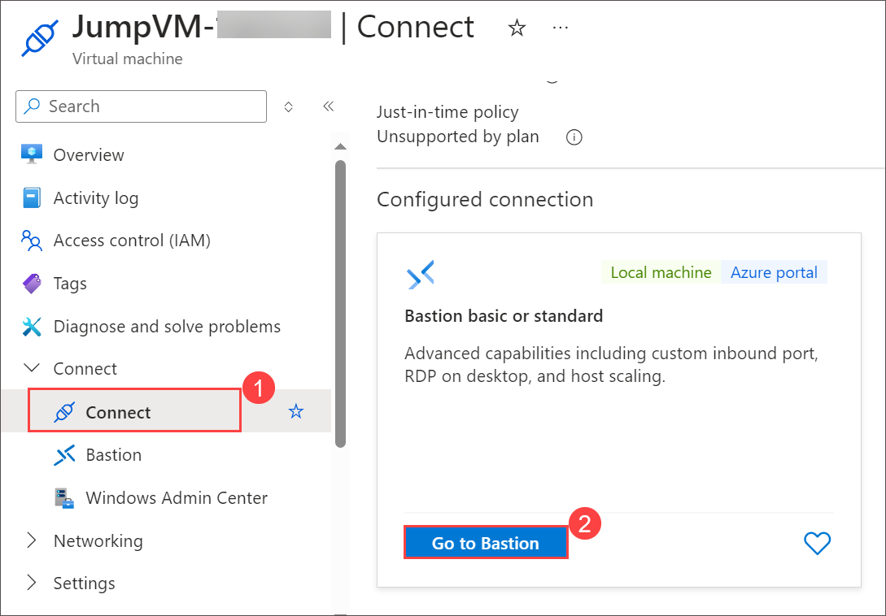
 
1. On the Bastion page, follow the below-mentioned instructions to connect to the Virtual Machine using Bastion:

    - **Authentication Type**: Select **VM Password (1)** from the drop-down
    - **Username**: Enter **demouser (2)**
    - **Password**: Enter **<inject key="JumpVM Admin Password" enableCopy="true"/> (3)**
    - Click on **Connect (4)**
 
      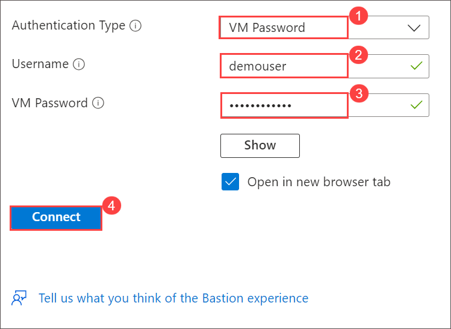

     >**Note:** If a pop-up is disallowing you kindly allow it and click on **Connect** to connect to the VM
 
1. Now, you will be redirected to a new tab where the Bastion VM is opened. If you see the pop-up **See text and images copied to the clipboard**, click on **Allow**.
 
    
 
1. Within the Bastion VM, search for **Edge (1)** and select **Microsoft Edge (2)**.
 
    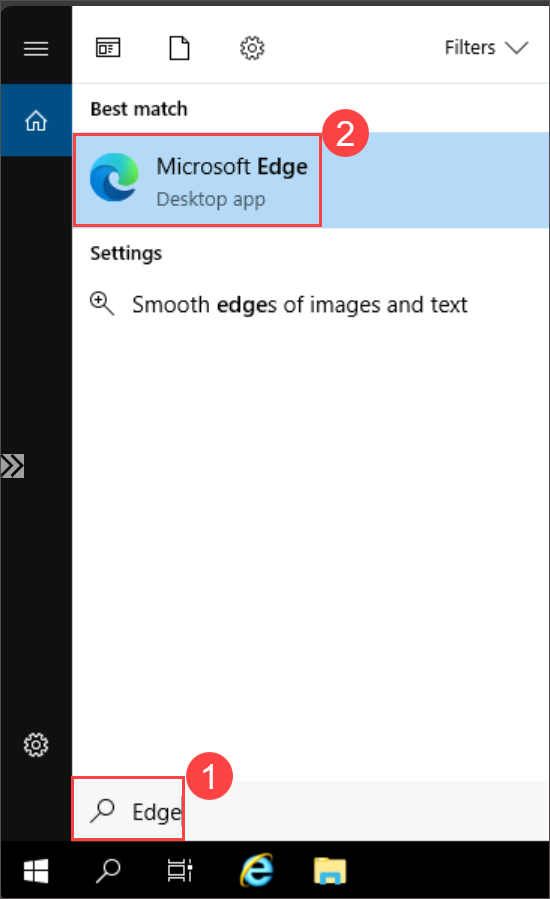
 
1. Navigate to the below-mentioned URL and you can see the error **can't reach this page**.
 
    ```
    https://www.nfl.com
    ```
    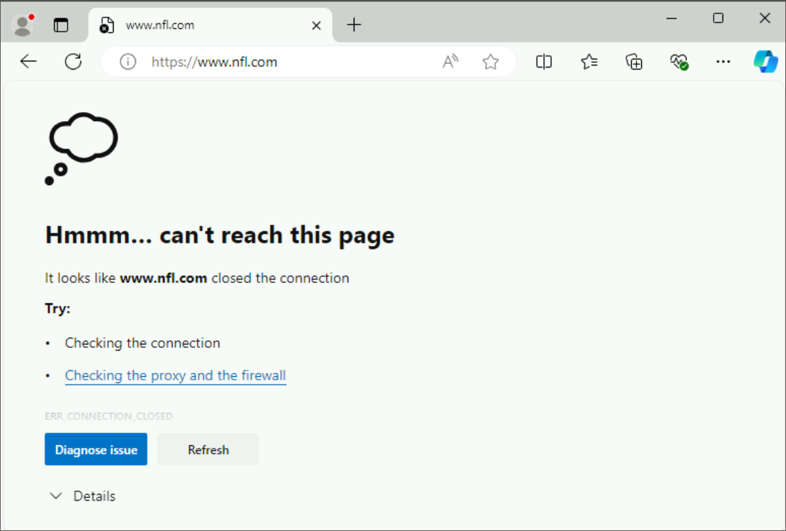
 
     >**Note:** In order to paste within a bastion session copy  the content to the clipboard by clicking the arrow icon  within the bastion vm and paste it

     

1. Navigate back to the other tab, where Azure Portal is opened.
 
1. In the Azure portal, go to your **JumpVM-rg** resource group and select **firewallpolicy**.
 
   
 
1. Select **TLS inspection (1)** under the **Settings** tab and enter the below details under the **Key vault** tab:
 
    - Parent policy: Choose **Enabled (2)**
    - Managed Identity: Select **(New) fw-cert-id-ZrNC4l8WLg97D  (3)** from the drop-down list
    - Key Vault: Select **(New) fw-cert-kv-ZrNC4l8WLg97D (4)** from the drop-down
    - Certificate: Select **(New) fw-cert-ZrNC4l8WLg97D (5)** from the drop-down
    - Click on **Save (6)**
 
      
 
1. Now, select **Application Rules (1)** from the **Settings** tab under the Firewall Policy page and select **+ Add a rule collection (2)**.
   
    
 
1. Under the **Add a rule collection** page, enter the below details to enable the web application in Bastion VM:
 
    - Name: **GeneralWeb (1)**
    - Rule Collection type: **Application (2)**
    - Priority: **103 (3)**
    - Rule collection group: **DefaultApplicationRuleCollectionGroup (4)**
    - Under **Rules (5)** mention the below details:
      - Name: **AllowSports**
      - Source type: Select **IP Address** from the drop-down list
      - Source: Enter *
      - Protocol: Enter **http,https**
      - TLS inspection: Check TLS inspection
      - Destination Type: Select **Web categories**
      - Destination: Enter `Sports`
     
     - Click on **Add (6)**
 
         
 
 1.  Once the deployment completes navigate back to the Bastion VM tab and refresh the page where you have browsed for `https://www.nfl.com`. On the Privacy error connection page, click on **Advanced**.
 
     
 
 1. Click on **Continue to www.nfl.com (unsafe)**.
 
    

    >**Note**: If you have trouble reaching www.nfl.com, try www.nba.com or www.nhl.com.
     
 1. Now you can see the NFL web page.
 
    
 
 1. Again, navigate to the other tab, where Azure Portal is opened.
 
 1. In the Azure portal, go to your **JumpVM-rg** resource group and select **AzureFirewall**.
 
     
 
 1. On the **AzureFirewall** page, select **Logs (1)** under the Monitoring tab, click on **Firewall Logs (Resource Specific Tables - Preview) (2)** and click on **Run (3)** for **Application rule log**.
 
     
 
     >**Note: In case you didn't find the Logs as expected, then it may take up to 6 hours to show up. Please refer to the screenshot for reference and continue with the next steps**.

     

## **Task 5: Implement and Test URL filtering**

In this task, you'll implement and test URL filtering with Azure Firewall. You'll first try to access a blocked URL from a Bastion VM. Then, you'll create an application rule in Azure Firewall to allow the URL, test the access again, and verify the changes by reviewing the firewall logs. 

1. Navigate back to the tab where you have opened Bastion VM and browse the below-mentioned URL. You can see the error **Action:Deny...**.
 
    ```
    www.nytimes.com/section/world
    ```
 
    
 
1. Now switch back to the other tab, where Azure Portal is opened and to your **JumpVM-rg** resource group then select **firewallpolicy**.
 
    
 
1. Select **Application Rules (1)** from the **Settings** tab under Firewall Policy page and select **+ Add a rule collection (2)**.
 
    
 
1. Under **Add a rule collection** page, enter the below details to enable the web application in Bastion VM:

    - Name: **Firewall-rulecollection (1)**
    - Rule Collection type: **Application (2)**
    - Priority: **100 (3)**
    - Rule collection group: **DefaultApplicationRuleCollectionGroup (4)**
    - Under **Rules (5)** mention the below details:
      - Name: **URLFiltering**
      - Source type: Select **IP Address** from the drop-down list
      - Source: Enter *
      - Protocol: Enter **http,https**
      - TLS inspection: Check TLS inspection
      - Destination Type: Select **URL**
      - Destination: Enter `www.nytimes.com/section/world`
     
     - Click on **Add (6)**
 
         

1. Once the deployment completes navigate back to the Bastion VM tab and refresh the page where you have browsed for `www.nytimes.com/section/world`. On the Privacy error connnection page, click on **Advanced**.
 
      
 
1. Click on **Continue to www.nytimes.com (unsafe)**.
 
    
 
1. Now you validate that the HTML response is displayed as expected in the browser.
 
    
 
1. Again, navigate to the other tab, where Azure Portal is opened.
 
1. In the Azure portal, go to your **JumpVM-rg** resource group and select **AzureFirewall**.
 
    
 
1. On the **AzureFirewall** page, select **Logs (1)** under the Monitoring tab, click on **Firewall Logs (Resource Specific Tables - Preview) (2)** and click on **Run (3)** for **Application rule log**.
 
    

    >**Note: In case you didn't find the Logs as expected, then it may take up to 6 hours to show up. Please refer to the screenshot for reference and continue with the next steps**.

    

## **Task 6: IP Groups**

In this task, you'll create an IP Group in Azure, then use it in a firewall rule to allow access to a specific website from a Bastion VM. You'll first observe the blocked access, configure the rule with the IP Group, and then verify that the website loads correctly.

1. Navigate to the home page in the Azure portal, search for **IP groups (1)** and **select (2)** from suggestions.
 
    
 
1. Click on **+ Create** to create a IP Group.
  
     
 
1. On the IP Group page, on the **Basics** tab, enter or select the following information and click on **Next: IP addresses > (4)**.
 
      | **Setting**      | **Value**                                                    |
      | ---------------- | ------------------------------------------------------------ |
      | Subscription     | Select your subscription.                                    |
      | Resource group   | Select the resource group **JumpVM-rg (1)**                  |
      | Name             | Enter **IpGroup (2)**                                        |
      | Region           | Select **East US (3)**                                       |
 
      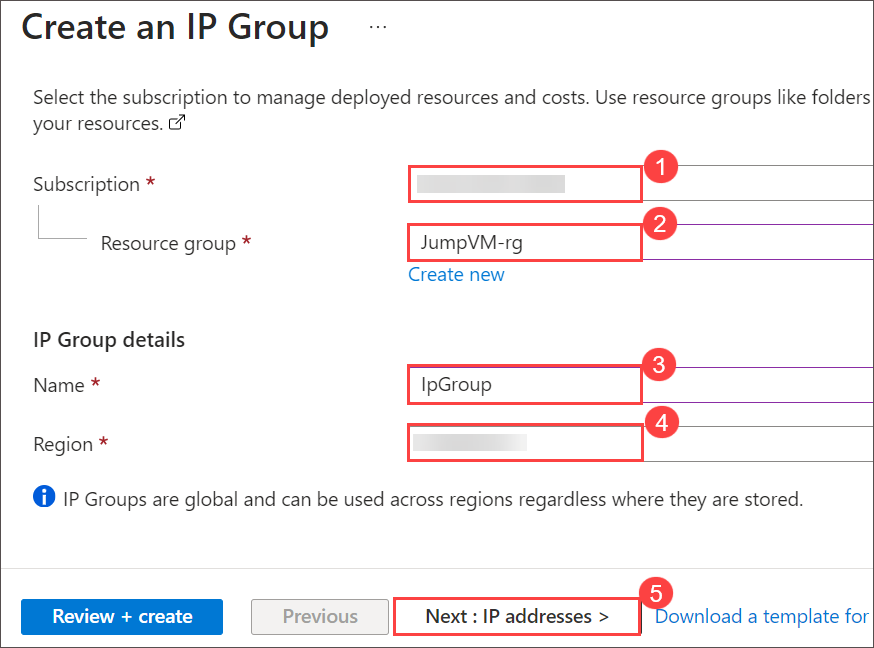

1. On the **IP addresses** tab, enter `*` in the **IP address, range or subnet (1)** field and then click **Review + Create (2)**.
 
    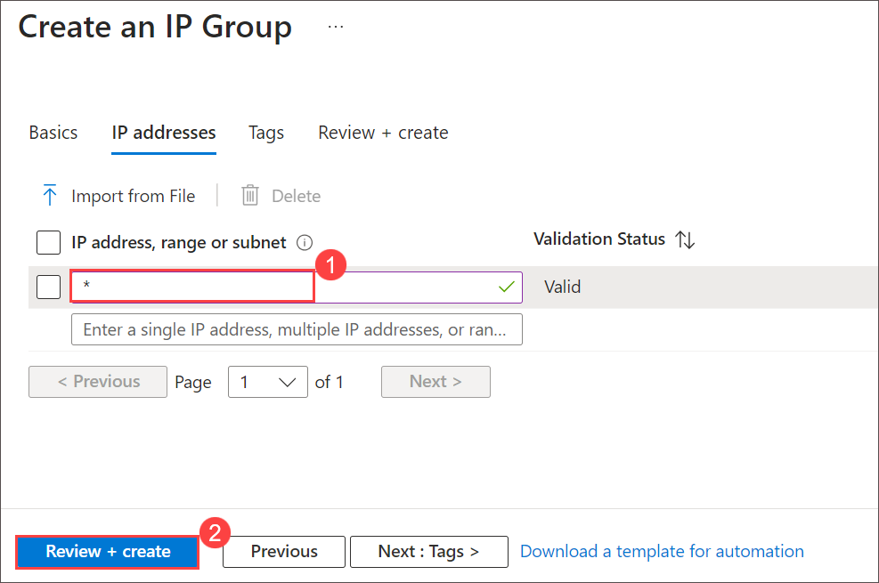
 
1. Review the Summary, and then select **Create**.
 
    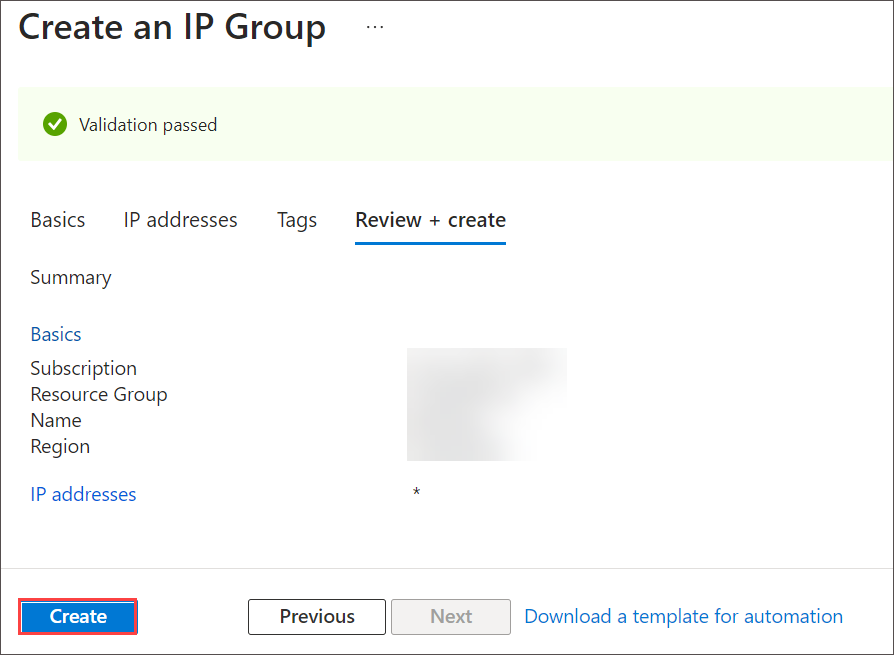

1. Navigate back to the tab where you have opened Bastion VM and browse the below-mentioned URL. You can see the error **can't reach this page**.
 
    ```
    www.news18.com
    ```
 
    
 
1. Now switch back to the other tab, where Azure Portal is opened and to your **JumpVM-rg** resource group then select **firewallpolicy**.
 
    
 
1. Select **Application Rules (1)** from the **Settings** tab under Firewall Policy page and select **+ Add a rule collection (2)**.
 
    

1. Under **Add a rule collection** page, enter the below details to enable the web application in Bastion VM:

    - Name: **Ipgroup-rule (1)**
    - Rule Collection type: **Application (2)**
    - Priority: **104 (3)**
	 - Rule collection action: **Allow (4)**
    - Rule collection group: **DefaultApplicationRuleCollectionGroup (5)**
    - Under **Rules (6)** mention the below details:
      - Name: **URL-Ipgroup**
      - Source type: Select **IP Group** from the drop-down list
      - Source: Enter **Ipgroup**
      - Protocol: Enter **http,https**
      - TLS inspection: Check TLS inspection
      - Destination Type: Select **URL**
      - Destination: Enter `www.news18.com`
     
     - Click on **Add (7)**
 
         

1. Once the deployment completes navigate back to the Bastion VM tab and refresh the page where you have browsed for `www.news18.com`. On the Privacy error connection page, click on **Advanced**.
 
      
 
1. Click on **Continue to www.news18.com (unsafe)**.
 
      

1. Now you validate that the HTML response is displayed as expected in the browser.
 
     
 
## **Task 7: Azure Firewall Policies with Firewall Manager (Optional)**

### **Task 7.1: Create a Firewall Policy**

In this task, you'll create an Azure Firewall Policy. You'll configure basic settings, leave DNS and TLS settings as default, and add network rules to allow web and RDP traffic between specified IP ranges. Finally, you'll review and create the policy.

1. Navigate to the home page in the Azure portal, search for **firewall manager (1)** and **select (2)** from suggestions.
 
    
 
1. On the Firewall Manager page, from the **Overview (1)** tab, select **View Azure Firewall Policies (2)**.
 
    
 
1. Select **+ Create Azure Firewall Policy**. 
 
1. On the Azure Firewall Policy page, on the **Basics** tab, enter or select the following information and click on **Next: DNS Settings > (5)**.
 
      | **Setting**      | **Value**                                                    |
      | ---------------- | ------------------------------------------------------------ |
      | Subscription     | Select your subscription.                                    |
      | Resource group   | Select the resource group **JumpVM-rg (1)**                  |
      | Name             | Enter **Policy-01 (2)**                                      |
      | Region           | Select **East US (3)**                                       |
      | Policy tier      | Select **Standard (4)**                                      |
 
      
 
1. On the **DNS Settings** tab, leave it as default and click on **Next: TLS inspection >**.
 
    
 
1. On the **TLS inspection** tab, leave it as default and click on **Next: Rules >**.
 
    

1. On the **Rules** tab, select **+ Add a rule collection**.

    
 
1. On the **Add a rule collection** page, enter or select the following information
 
    - Name: **App-RC-01 (1)**
    - Rule Collection type: **Network (2)**
    - Priority: **100 (3)**
    - Rule collection action: **Allow (4)**
    - Under **Rules (5)** mention the below details:
      - Name: Enter **AllowWeb**
      - Source type: Select **IP Address** from the drop-down list
      - Source: Enter **192.168.1.0/24**
      - Protocol: Select **TCP**
      - Destination Ports: **80**
      - Destination Type: Select **IP Address**
      - Destination: Enter **10.6.0.0/16**
    - On the next rule row, enter the following information:
      - Name: Enter **AllowRDP**
      - Source type: Select **IP Address** from the drop-down list
      - Source: Enter **192.168.1.0/24**
      - Protocol: Select **TCP**
      - Destination Ports: **3389**
      - Destination Type: Select **IP Address**
      - Destination: Enter **10.6.0.0/16**
    - Click on **Add (6)**
 
      
 
1. Select **Review + Create**.
 
    
 
1. Review the Summary page and then select **Create**.
 
    
 
### **Task 7.2: Create the firewall hub virtual network**

In this task, you'll create a secured virtual hub in Azure, which includes setting up a new virtual network with Azure Firewall. You'll configure basic settings, create a new Virtual WAN, and assign a public IP address to the firewall. Finally, you'll review the setup and deploy the secured virtual hub.
 
1. Navigate to the home page in the Azure portal, search for **firewall manager (1)** and **select (2)** from suggestions.
 
    
 
1. On the Firewall Manager, from the **Overview (1)** tab, select **View secured virtual hubs (2)**.
 
    

1. On the **Virtual hubs** page, select Create **+ Create new secured virtual hub**.
 
1. On the secured virtual hub page, on the **Basics** tab, enter or select the following information and click on **Next: Azure Firewall > (8)**.
   
      | **Setting**                                   | **Value**                                                    |
      | ----------------------------------------------| ------------------------------------------------------------ |
      | Subscription                                  | Select your subscription.                                    |
      | Resource group                                | Select the resource group **JumpVM-rg (1)**                  |
      | Region                                        | Select **East US (2)**                                       |
      | Secured virtual hub name                      | Enter **Hub-01 (3)**                                         |
      | Hub address space                             | Enter **10.2.0.0/16 (4)**                                    |
      | Choose an existing vWAN or create a new one   | Choose **New vWAN (5)**                                      |
      | Virtual WAN Name                              | Enter **Vwan-01 (6)**                                        |
      | Type                                          | Select **Standard (7)**                                      |

      

   1. On the **Azure Firewall** tab,for **Specify number of Public IP addresses** enter **1** and leave the others as default and click on **Next: Security Partner Provider**.
   
       
 
1. On the **Security Partner Provider** tab, leave it to default and click on **Next: Review + create**.
 
    

1. Review the **Summary** page and select **Create**.  
 
    >**Note**: Deployment may take up to 30 minutes to complete.
 
    
 
### **Task 7.3: Associate the firewall policy with the virtual hub**

In this task, you'll associate a firewall policy with a secured virtual hub. You'll select the firewall policy, manage its associations, and link it to the virtual hub. Finally, you'll verify that the policy is correctly associated and secured.
  
1. From the Azure portal home page, select **Firewall Manager**. On the Firewall Manager page, under **Security**, select **Azure Firewall Policies**.
  
    
 
1. Select the checkbox for **Policy-01 (1)**, select **Manage associations(2)** and then select **Associate hubs (3)**.
 
    
 
1. On the **Secure hubs with Azure Firewall Policy** page, Select the checkbox for **Hub-01 (1)** and Select **Add (2)**.
  
    
 
1. When the policy has been attached, select **Refresh**. The association should be displayed.
   
    
 
1. To open the firewall policy, click **Policy-01**, then under Settings, select **Secured virtual hubs (1)**. You will see that your policy status is **Secured (2)**.
 
    	
	
   <validation step="9f40f014-c785-4918-bde1-dadc915aada2" /> 

   > **Congratulations** on completing the lab! Now, it's time to validate it. Here are the steps:
    > - Navigate to the Lab Validation Page, from the upper right corner in the lab guide section.
    > - Hit the Validate button for the corresponding task. If you receive a success message, you can proceed to the next task. 
    > - If not, carefully read the error message and retry the step, following the instructions in the lab guide.
    > - If you need any assistance, please contact us at cloudlabs-support@spektrasystems.com. We are available 24/7 to help you out.

## Summary

In this Exercise, you'll configure an Azure Application Gateway with Web Application Firewall (WAF) to protect your applications. Set up Azure Firewall for network traffic filtering, configure logging, and test intrusion detection/prevention systems (IDPS). Implement URL filtering, web categories, and IP groups for enhanced security. Optionally, use Firewall Manager to manage policies across multiple firewalls.

## Review
 
In this exercise you have covered the following:
   - Configure WAF to protect your web application
   - Added firewall diagnostics settings 
   - Tested IDPS for HTTP traffic
   - Performed Web category testing 
   - Implemented and Tested URL filtering
   - Performed IP groups
   - Performed Azure Firewall Policies with the Firewall Manager

## You have successfully completed the lab.
