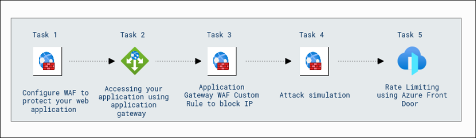
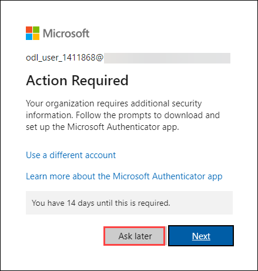

# Getting Started with Your Microsoft Azure Infrastructure and Application Security Workshop

### Overall Estimated Duration : 2 hours 30 Minutes

## Overview 

This lab focuses on improving the security and performance of web applications using Azure's network and application protection services. You'll explore **Azure Firewall**, which provides scalable, stateful protection for Azure Virtual Network resources, and **Azure Application Gateway** with **Web Application Firewall (WAF)**, which protects against common web vulnerabilities like SQL injection and XSS attacks.

In this exercise, you’ll deploy and configure Azure Firewall, Application Gateway with WAF, and Azure Front Door to secure a sample application. Key tasks include setting up WAF for protection, creating custom rules to block IPs, simulating attacks, and applying rate limiting with Azure Front Door to optimize and secure the application.

## Objective  

**Secure Application:** Learn to configure **Web Application Firewall (WAF)** to protect your web application and ensure its security. Gain hands-on experience in accessing your application using **Azure Application Gateway**. Learn how to create **custom rules in Application Gateway WAF** to block specific IP addresses and protect against potential threats. Simulate attacks to test your application’s security measures and implement **rate limiting** using **Azure Front Door** to control traffic and prevent overloading. This lab will help you understand and apply best practices to secure and optimize web applications hosted on Azure.

## Prerequisites

Participants should have:

- **Basic Knowledge of Microsoft Azure:** Familiarity with the Azure portal and working with virtual networks, web applications, and cloud security.
- **Understanding of Web Application Security:** Basic understanding of web application vulnerabilities and security practices like WAF and rate limiting.
- **Familiarity with Azure Networking Services:** Knowledge of services like Azure Front Door and Application Gateway.
- **Basic Experience with Azure Firewall:** Understanding of how to configure and manage network security in Azure.

## Architecture

The architecture begins with configuring Azure Application Gateway to serve as the front-end for the web application, followed by adding the Virtual Machine to the backend pool of the Application Gateway. The Application Gateway is also configured with a Firewall Policy, which secures the application by applying security rules. After setting up the Application Gateway, users can access the application through this secure entry point.

Next, Application Gateway WAF Custom Rules are created to block specific IPs, such as the Lab VM’s public IP, ensuring that only authorized traffic can access the application. Once security is in place, an Attack Simulation is performed, testing the application for vulnerabilities like Cross-Site Scripting (XSS), where malicious scripts are injected into the application to assess its resilience.

Finally, to ensure performance and security, Azure Front Door is deployed with rate limiting enabled to regulate traffic and ensure that the application can handle high loads while maintaining security across multiple regions. This configuration ensures that traffic is directed to the nearest application instance and can automatically failover in case of regional unavailability.

## Architecture Diagram 

 

## Explanation of Components 

The architecture for this lab involves the following key components: 

- **Azure Application Gateway**: Acts as the entry point for the web application, routing traffic to the backend. It integrates with Web Application Firewall (WAF) to inspect incoming traffic and prevent malicious attacks, such as SQL injection and XSS, ensuring a secure application environment.

- **Web Application Firewall (WAF)**: Integrated with both Azure Application Gateway and Azure Front Door, the WAF helps protect the web application from threats and vulnerabilities by filtering and blocking malicious traffic based on custom security policies. It ensures the application remains secure from a range of attacks.

- **Azure Front Door**: A global load balancer and traffic manager that ensures high availability and low latency for the application by routing traffic to the nearest region. It provides an additional layer of security through its own WAF and rate limiting features, preventing abuse by controlling the number of requests a client can make within a specified time frame.

- **Azure Virtual Machines (VMs)**: Hosts the backend services of the application, providing the necessary compute resources for processing requests and serving the application content. These VMs are protected by the Application Gateway and WAF to ensure that only secure traffic reaches the backend.

- **Rate Limiting (via Azure Front Door)**: This feature controls the number of requests that a client can make within a specific time period, protecting the application from Denial of Service (DoS) attacks. Rate limiting ensures the application remains responsive and maintains a smooth user experience, even under heavy traffic conditions.

## Getting Started with the Lab 

Once you're ready to dive in, your virtual machine and lab guide will be right at your fingertips within your web browser.

 

>**Note:** If you observe any PowerShell script being executed on the VM, kindly do not close the window. Allow the script to complete its execution fully before taking any further actions.

## Virtual Machine & Lab Guide

In the integrated environment, the lab VM serves as the designated workspace, while the lab guide is accessible on the right side of the screen.

**Note**: Kindly ensure that you are following the instructions carefully to ensure the lab runs smoothly and provides an optimal user experience.

## Exploring Your Lab Resources

To get a better understanding of your lab resources and credentials, navigate to the **Environment Details** tab.

   
## Utilizing the Split Window Feature
 
For convenience, you can open the lab guide in a separate window by selecting the **Split Window** button from the Top right corner.
 

## Lab Guide Zoom In/Zoom Out
 
To adjust the zoom level for the environment page, click the **A↕ : 100%** icon located next to the timer in the lab environment. 

  

## Managing Your Virtual Machine

Feel free to start, stop, or restart your virtual machine as needed from the **Resources** tab. Your experience is in your hands!

  
## Let's Get Started with Azure Portal

1. On your virtual machine, click on the Azure Portal icon as shown below:

   
   
1. You'll see the **Sign into Microsoft Azure** tab. Here, enter your credentials:
 
   - **Email/Username:** <inject key="AzureAdUserEmail"></inject>
 
      

1. Next, provide your password:
 
   - **Password:** <inject key="AzureAdUserPassword"></inject>
 
      

1. If **Action Required** window pop up click on **Ask later**. 

    
 
1. If prompted to stay signed in, you can click "No." 

    

1. If you see the pop-up **Sign in to sync data**, Click on **No,thanks.** 

1. If you see the pop-up **You have free Azure Advisor recommendations!**, close the window to continue the lab.

1. If a **Welcome to Microsoft Azure** popup window appears, click **Cancel** to skip the tour.

## Support Contact
 
The CloudLabs support team is available 24/7, 365 days a year, via email and live chat to ensure seamless assistance at any time. We offer dedicated support channels tailored specifically for both learners and instructors, ensuring that all your needs are promptly and efficiently addressed.

Learner Support Contacts:
- Email Support: cloudlabs-support@spektrasystems.com
- Live Chat Support: https://cloudlabs.ai/labs-support

Now, click on **Next** from the lower right corner to move on to the next page. 

### Happy Learning!!