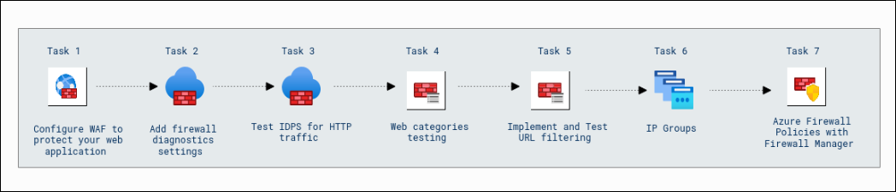

# Getting Started with Your Microsoft Azure Infrastructure and Application Security Workshop

### Overall Estimated Duration : 2 Hours 30 Minutes

## Overview 

Azure Firewall is a cloud-native network security service designed to protect your resources in Microsoft Azure. With Azure Firewall, you can secure your virtual networks against threats, monitor traffic, enforce network policies, and control access to resources. It integrates seamlessly with other Azure services like Application Gateway, Firewall Manager, and Diagnostics to provide comprehensive protection and operational insights.

In this hands-on lab, you will configure and manage multiple network security features in Azure, including Web Application Firewall (WAF), Azure Firewall policies, diagnostic settings, and URL filtering. You will set up WAF to protect a web application, test intrusion detection and prevention systems (IDPS), and implement web traffic filtering for specific URL categories. Additionally, you will learn how to manage IP groups and associate firewall policies with secured virtual hubs using Azure Firewall Manager. Through these tasks, you will gain practical experience in securing and monitoring network traffic, creating firewall rules, and optimizing your Azure network security strategy.

## Objective  

**Secure Infrastructure with Azure Firewall Premium:** Learn to configure and manage network security in Azure by setting up and optimizing Azure Firewall, Web Application Firewall (WAF), and related security features. You will gain hands-on experience in securing web applications using WAF within an Azure Application Gateway, protecting your applications from common vulnerabilities. Additionally, you will learn to configure diagnostic settings for Azure Firewall, enabling comprehensive logging and monitoring of network traffic for effective threat detection and analysis. The lab also covers testing the Intrusion Detection and Prevention System (IDPS) to detect and mitigate malicious traffic, ensuring your network remains secure against cyber threats. You will also learn to implement web access controls, such as testing web categories and applying URL filtering to restrict access to specific websites. Further, the lab guides you in creating and managing IP groups for more efficient firewall rule configuration. Finally, you will learn to create and associate Azure Firewall policies with secured virtual hubs, ensuring centralized security management and policy enforcement across your Azure infrastructure. By the end of this lab, you will develop the skills needed to effectively secure your Azure network, optimize firewall configurations, and enhance your network security posture.
## Prerequisites

Participants should have:

- **Understanding of Azure Networking and Security**: Basic knowledge of networking concepts such as virtual networks, subnets, and network security groups (NSGs) within Azure.
- **Familiarity with Azure Firewall and Web Application Firewall (WAF)**: Basic understanding of Azure Firewall and WAF features, including their purpose and functionality for network security.
- **Basic Understanding of Firewall Rules and Policies**: Familiarity with how to create and manage firewall rules and security policies in Azure to control network traffic.
- **Experience with Diagnostic Settings and Logs**: Knowledge of how to configure diagnostic settings and view logs in Azure to monitor and troubleshoot resources effectively.
- **Experience in Network Configuration**: Basic understanding of configuring route tables, public IP addresses, and Network Address Translation (NAT) rules in Azure.
- **Basic Knowledge of Web Application Security**: Understanding the fundamentals of web application security and the role of firewall rules in protecting applications from cyber threats.

## Architecture

The architecture involves configuring an Azure Application Gateway with Web Application Firewall (WAF) to safeguard the web application by filtering malicious traffic and ensuring secure access. Azure Firewall is deployed with diagnostic settings enabled to capture detailed logs of network traffic, including application and network rules, to monitor and detect threats. Intrusion Detection and Prevention System (IDPS) is tested by simulating HTTP traffic attacks and applying updated signature rules for real-time threat mitigation. A DNAT rule is set up to simulate attack traffic through the firewall and monitor its impact.

The architecture also includes the configuration of route tables to direct traffic through the firewall for filtering and security. Web category filtering is tested by accessing allowed and restricted websites from a JumpVM, ensuring proper filtering policies are applied. URL filtering is implemented to control access to specific websites by creating application rules in the firewall policy, allowing or blocking URLs based on defined criteria.

For more centralized management, IP Groups are used to simplify rule creation and management, grouping multiple IP ranges into a single object for easier access control. Azure Firewall Policies are applied across the network to enforce security measures and control traffic flow, while a secured virtual hub is created to integrate Azure Firewall for enhanced network protection, ensuring secure connectivity between different resources in the architecture.
## Architecture Diagram 

 

## Explanation of Components 

The architecture for this lab involves the following key components:

- **Azure Application Gateway with Web Application Firewall (WAF):** The Application Gateway serves as a load balancer and firewall to protect web applications from malicious traffic. The WAF feature helps filter out harmful HTTP requests, providing protection against common web vulnerabilities, such as SQL injection and cross-site scripting (XSS). It ensures that only safe and legitimate traffic reaches the application.

- **Azure Firewall:** A stateful firewall that provides network-level security and traffic monitoring. It helps manage and filter both inbound and outbound traffic across multiple network interfaces. Azure Firewall protects resources by blocking unauthorized access, defining application and network rules, and allowing traffic only from specified IP addresses and protocols.

- **Diagnostic Settings in Azure Firewall:** Diagnostic settings are configured to collect and store detailed logs related to network traffic, including application rule hits, threat intelligence, DNS queries, and flow logs. These logs are sent to a Log Analytics workspace for further analysis, helping to identify potential security threats and analyze network traffic patterns.

- **Intrusion Detection and Prevention System (IDPS):** A critical security feature of the firewall, the IDPS monitors traffic to detect and respond to possible attacks. By simulating HTTP traffic attacks and adjusting the signature rules, you can enhance the firewall’s ability to prevent malicious activities and ensure the system remains secure in real-time.

- **Route Table:** A route table directs the network traffic to the correct destination, typically through a virtual appliance (in this case, the firewall) for inspection. By configuring custom route tables, traffic from resources in a virtual network can be sent through the firewall, enabling centralized security management.

- **URL Filtering:** A feature that allows you to control access to specific websites or web applications based on URLs. The firewall enforces these filtering rules to block or allow traffic to certain sites, improving security by preventing access to potentially harmful or unwanted websites.

- **IP Groups in Azure Firewall:** IP Groups simplify firewall rule creation by grouping multiple IP addresses into a single object. This reduces the complexity of managing individual IP addresses and makes the firewall configuration more efficient by allowing easier updates and maintenance of access rules.

- **Azure Firewall Policies:** Azure Firewall policies define the rules that determine which network traffic is allowed or denied. These policies can include both application and network rules, and can be applied to multiple firewalls in the architecture to ensure consistent security across the entire network.

- **Secured Virtual Hub:** A central component in a virtual WAN architecture that integrates Azure Firewall for enhanced network security. The virtual hub enables secure and efficient traffic routing between different resources, ensuring that all traffic is inspected and filtered through the Azure Firewall to protect the network from potential threats.

## Getting Started with the Lab 

Once you're ready to dive in, your virtual machine and lab guide will be right at your fingertips within your web browser.

 

>**Note:** If you observe any PowerShell script being executed on the VM, kindly do not close the window. Allow the script to complete its execution fully before taking any further actions.

## Virtual Machine & Lab Guide

In the integrated environment, the lab VM serves as the designated workspace, while the lab guide is accessible on the right side of the screen.

**Note**: Kindly ensure that you are following the instructions carefully to ensure the lab runs smoothly and provides an optimal user experience.

## Exploring Your Lab Resources

To get a better understanding of your lab resources and credentials, navigate to the **Environment Details** tab.

   
## Utilizing the Split Window Feature
 
For convenience, you can open the lab guide in a separate window by selecting the **Split Window** button from the Top right corner.
 

## Lab Guide Zoom In/Zoom Out
 
To adjust the zoom level for the environment page, click the **A↕ : 100%** icon located next to the timer in the lab environment. 

  

## Managing Your Virtual Machine

Feel free to start, stop, or restart your virtual machine as needed from the **Resources** tab. Your experience is in your hands!

  
## Let's Get Started with Azure Portal

1. On your virtual machine, click on the Azure Portal icon as shown below:

   
   
1. You'll see the **Sign into Microsoft Azure** tab. Here, enter your credentials:
 
   - **Email/Username:** <inject key="AzureAdUserEmail"></inject>
 
      

1. Next, provide your password:
 
   - **Password:** <inject key="AzureAdUserPassword"></inject>
 
      

1. If **Action Required** window pop up click on **Ask later**. 

    
 
1. If prompted to stay signed in, you can click "No." 

    

1. If you see the pop-up **Sign in to sync data**, Click on **No,thanks.** 

1. If you see the pop-up **You have free Azure Advisor recommendations!**, close the window to continue the lab.

1. If a **Welcome to Microsoft Azure** popup window appears, click **Cancel** to skip the tour.

## Support Contact
 
The CloudLabs support team is available 24/7, 365 days a year, via email and live chat to ensure seamless assistance at any time. We offer dedicated support channels tailored specifically for both learners and instructors, ensuring that all your needs are promptly and efficiently addressed.

Learner Support Contacts:
- Email Support: cloudlabs-support@spektrasystems.com
- Live Chat Support: https://cloudlabs.ai/labs-support

Now, click on **Next** from the lower right corner to move on to the next page. 

### Happy Learning!!
