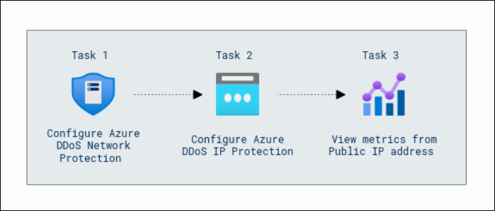

# Getting Started with Your Microsoft Azure Infrastructure and Application Security Workshop

### Overall Estimated Duration : 1 hour 30 Minutes

## Overview 

Azure DDoS Protection is a comprehensive solution designed to defend cloud-based infrastructures from distributed denial-of-service (DDoS) attacks. By leveraging Azure's global network scale and advanced mitigation techniques, this service ensures the availability and security of your applications against volumetric, protocol, and application-layer attacks. Azure DDoS Protection works seamlessly with your virtual networks and public IP addresses to provide robust security without requiring application changes.  

In this hands-on lab, you will configure Azure DDoS Protection to safeguard your cloud infrastructure. You will set up a DDoS protection plan, secure public IP addresses, and monitor key metrics to identify and mitigate potential threats. Through these tasks, you'll gain practical experience in protecting virtual networks and public-facing resources, ensuring resilience and high availability for your applications.

## Objective  
 
**Protecting Infrastructure with Azure DDoS Protection Plans:** Learn to configure and manage Azure DDoS Protection to safeguard your cloud infrastructure against distributed denial-of-service (DDoS) attacks. In this lab, you will set up a DDoS protection plan to enhance the security of virtual networks and configure IP protection to defend public-facing IP addresses from potential threats. Gain hands-on experience in monitoring and analyzing key metrics such as inbound SYN, TCP, and UDP packets to proactively detect and mitigate DDoS attacks. By the end of this lab, you will have the skills to effectively secure your Azure resources.

## Prerequisites

Participants should have:  
  
- **Understanding of Virtual Networks (VNets)**: Familiarity with the concept of virtual networks, their role in cloud infrastructure, and how they interact with other Azure resources.  
- **Awareness of DDoS Concepts**: Basic understanding of Distributed Denial of Service (DDoS) attacks, including their types (volumetric, protocol, and resource layer attacks) and impact on availability and security.  
- **Basic Monitoring Skills**: Familiarity with Azure's monitoring tools, including visualizing metrics and interpreting data for proactive threat detection and mitigation.  

## Architecture

The architecture involves using Azure DDoS Protection Plans to safeguard against various types of DDoS attacks. DDoS Network Protection is configured to defend the Virtual Network, providing automatic mitigation for volumetric, protocol, and resource layer attacks. The Public IP Address is secured through DDoS IP Protection, which ensures that external-facing resources are protected against DDoS threats. Finally, Azure Metrics is used to visualize traffic data, allowing administrators to monitor key indicators like inbound SYN, TCP, and UDP packets to track DDoS mitigation performance and ensure that the infrastructure remains secure and resilient against potential attacks.

## Architecture Diagram 

 

## Explanation of Components

The architecture for this lab involves the following key components:

- **Azure DDoS Protection Plans:** Central to mitigating distributed denial-of-service (DDoS) attacks, this component provides automatic protection for resources in the virtual network. It defends against volumetric, protocol, and resource-layer attacks, ensuring high availability and security.

- **Public IP Address:** Represents the external-facing endpoint of Azure resources. DDoS IP Protection is configured on specific public IP addresses, enhancing security for applications and services exposed to the internet.

- **Azure Metrics:** Enables monitoring and visualization of network activity and DDoS mitigation metrics. It provides insights into traffic patterns, such as inbound SYN, TCP, and UDP packets, which are crucial for detecting and managing DDoS attempts effectively.

- **Firewall Manager:** Acts as a centralized management tool for monitoring the deployment and protection status of virtual networks. It confirms that DDoS protection is active and operational across configured resources.

## Getting Started with the Lab 

Once you're ready to dive in, your virtual machine and lab guide will be right at your fingertips within your web browser.

 

>**Note:** If you observe any PowerShell script being executed on the VM, kindly do not close the window. Allow the script to complete its execution fully before taking any further actions.

## Virtual Machine & Lab Guide

In the integrated environment, the lab VM serves as the designated workspace, while the lab guide is accessible on the right side of the screen.

**Note**: Kindly ensure that you are following the instructions carefully to ensure the lab runs smoothly and provides an optimal user experience.

## Exploring Your Lab Resources

To get a better understanding of your lab resources and credentials, navigate to the **Environment Details** tab.

   
## Utilizing the Split Window Feature
 
For convenience, you can open the lab guide in a separate window by selecting the **Split Window** button from the Top right corner.
 

## Lab Guide Zoom In/Zoom Out
 
To adjust the zoom level for the environment page, click the **A↕ : 100%** icon located next to the timer in the lab environment. 

  

## Managing Your Virtual Machine

Feel free to start, stop, or restart your virtual machine as needed from the **Resources** tab. Your experience is in your hands!

  
## Let's Get Started with Azure Portal

1. On your virtual machine, click on the Azure Portal icon as shown below:

   
   
1. You'll see the **Sign into Microsoft Azure** tab. Here, enter your credentials:
 
   - **Email/Username:** <inject key="AzureAdUserEmail"></inject>
 
      

1. Next, provide your password:
 
   - **Password:** <inject key="AzureAdUserPassword"></inject>
 
      

1. If **Action Required** window pop up click on **Ask later**. 

    
 
1. If prompted to stay signed in, you can click "No." 

    

1. If you see the pop-up **Sign in to sync data**, Click on **No,thanks.** 

1. If you see the pop-up **You have free Azure Advisor recommendations!**, close the window to continue the lab.

1. If a **Welcome to Microsoft Azure** popup window appears, click **Cancel** to skip the tour.

## Support Contact
 
The CloudLabs support team is available 24/7, 365 days a year, via email and live chat to ensure seamless assistance at any time. We offer dedicated support channels tailored specifically for both learners and instructors, ensuring that all your needs are promptly and efficiently addressed.

Learner Support Contacts:
- Email Support: cloudlabs-support@spektrasystems.com
- Live Chat Support: https://cloudlabs.ai/labs-support

Now, click on **Next** from the lower right corner to move on to the next page. 

### Happy Learning!!
