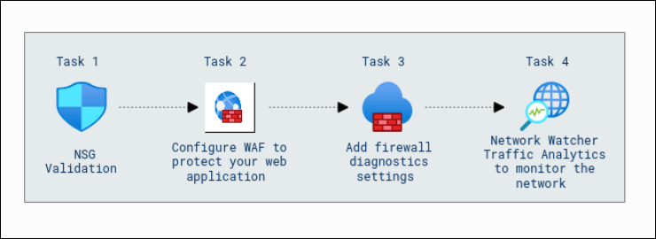

# Getting Started with Your Microsoft Azure Infrastructure and Application Security Workshop

### Overall Estimated Duration : 2 hours

## Overview

In this hands-on lab, you will explore network management and monitoring in Azure, focusing on essential components such as Network Security Groups (NSGs), Web Application Firewall (WAF), and Traffic Analytics. You will learn how to configure and validate inbound port rules in NSGs to control access to virtual machines (VMs), and you will practice configuring a Web Application Firewall policy for enhanced protection of your web applications through an Application Gateway. Additionally, you will enable diagnostic settings for Azure Firewall to monitor network activities and gain insights from logs and metrics. The lab also covers the use of Traffic Analytics in Network Watcher to analyze network traffic patterns, optimize performance, and detect security threats. 

## Objective  

**Network Management and Monitoring Revisited: Flow Logs and Traffic Analytics** Learn to configure and manage network security in Azure by setting up Network Security Groups (NSGs) to define inbound port rules, controlling virtual machine (VM) access, and ensuring only authorized traffic is allowed. Gain hands-on experience configuring a Web Application Firewall (WAF) policy using Azure's Application Gateway to protect web applications from common threats and vulnerabilities. Additionally, practice enabling diagnostic settings for Azure Firewall to collect and analyze logs and metrics, enhancing network visibility. Explore how to use Traffic Analytics in Azure Network Watcher to monitor and optimize network traffic, detect potential security threats, and gain insights into traffic patterns to improve network performance. These activities will help you develop the skills necessary to manage and secure Azure network environments effectively.

## Prerequisites

Participants should have:

- **Basic Knowledge of Azure Networking:** Familiarity with core Azure networking components, such as Virtual Networks, Subnets, and Public/Private IP addresses.
- **Understanding of Network Security:** Basic understanding of network security concepts, such as access control, inbound and outbound traffic, and firewall management.
- **Experience with Network Security Groups (NSGs) and Web Application Firewalls (WAF):** Familiarity with configuring NSGs and WAF policies to secure applications and services in Azure.
- **Familiarity with Azure Monitoring Tools:** Basic understanding of diagnostic settings and traffic analytics using Azure Network Watcher and Azure Firewall logs.

## Architecture

The lab architecture focuses on securing and monitoring the network environment by validating Network Security Groups (NSGs) to control traffic flow, configuring a Web Application Firewall (WAF) to protect the web application from common threats like SQL injection and cross-site scripting, and adding firewall diagnostic settings to log network traffic for analysis and troubleshooting. Additionally, Network Watcher Traffic Analytics is used to monitor real-time network traffic, identify performance issues, and detect anomalies. Together, these components create a structured flow that enhances network security, ensures comprehensive monitoring, and enables proactive management of the network, optimizing both performance and security across the lab environment.

## Architecture Diagram 

 

## Explanation of Components 

The architecture for this lab involves the following key components:

- **Network Security Groups (NSGs):** NSGs are used to control network traffic and enhance security within the environment. They allow you to define inbound and outbound security rules for your network interfaces, ensuring that only authorized traffic can access your resources while blocking any unwanted traffic. This ensures that the network environment is properly segmented and secure.
- **Web Application Firewall (WAF):** WAF is configured to protect web applications by filtering and monitoring HTTP traffic. It provides robust protection against common threats such as SQL injection, cross-site scripting (XSS), and other web application vulnerabilities. By integrating WAF into the environment, you safeguard the applications from malicious attacks and ensure a secure access layer.
- **Firewall Diagnostic Settings:** Firewall diagnostic settings are configured to log network traffic for analysis and troubleshooting. These logs help monitor the firewall’s behavior, detect potential issues, and ensure that traffic filtering is working as expected. They are critical for maintaining security and visibility into network traffic.
- **Network Watcher Traffic Analytics:** This tool is used to monitor and analyze network traffic in real-time. It provides insights into the flow of data within the network, helping identify performance bottlenecks, anomalies, or security threats. Traffic Analytics is essential for understanding the overall network health and making data-driven decisions for optimization.

## Getting Started with the Lab 

Once you're ready to dive in, your virtual machine and lab guide will be right at your fingertips within your web browser.

 

>**Note:** If you observe any PowerShell script being executed on the VM, kindly do not close the window. Allow the script to complete its execution fully before taking any further actions.

## Virtual Machine & Lab Guide

In the integrated environment, the lab VM serves as the designated workspace, while the lab guide is accessible on the right side of the screen.

**Note**: Kindly ensure that you are following the instructions carefully to ensure the lab runs smoothly and provides an optimal user experience.

## Exploring Your Lab Resources

To get a better understanding of your lab resources and credentials, navigate to the **Environment Details** tab.

   
## Utilizing the Split Window Feature
 
For convenience, you can open the lab guide in a separate window by selecting the **Split Window** button from the Top right corner.
 

## Lab Guide Zoom In/Zoom Out
 
To adjust the zoom level for the environment page, click the **A↕ : 100%** icon located next to the timer in the lab environment. 

  

## Managing Your Virtual Machine

Feel free to start, stop, or restart your virtual machine as needed from the **Resources** tab. Your experience is in your hands!

  
## Let's Get Started with Azure Portal

1. On your virtual machine, click on the Azure Portal icon as shown below:

   
   
1. You'll see the **Sign into Microsoft Azure** tab. Here, enter your credentials:
 
   - **Email/Username:** <inject key="AzureAdUserEmail"></inject>
 
      

1. Next, provide your password:
 
   - **Password:** <inject key="AzureAdUserPassword"></inject>
 
      

1. If **Action Required** window pop up click on **Ask later**. 

    
 
1. If prompted to stay signed in, you can click "No." 

    

1. If you see the pop-up **Sign in to sync data**, Click on **No,thanks.** 

1. If you see the pop-up **You have free Azure Advisor recommendations!**, close the window to continue the lab.

1. If a **Welcome to Microsoft Azure** popup window appears, click **Cancel** to skip the tour.

## Support Contact
 
The CloudLabs support team is available 24/7, 365 days a year, via email and live chat to ensure seamless assistance at any time. We offer dedicated support channels tailored specifically for both learners and instructors, ensuring that all your needs are promptly and efficiently addressed.

Learner Support Contacts:
- Email Support: cloudlabs-support@spektrasystems.com
- Live Chat Support: https://cloudlabs.ai/labs-support

Now, click on **Next** from the lower right corner to move on to the next page. 

### Happy Learning!!
